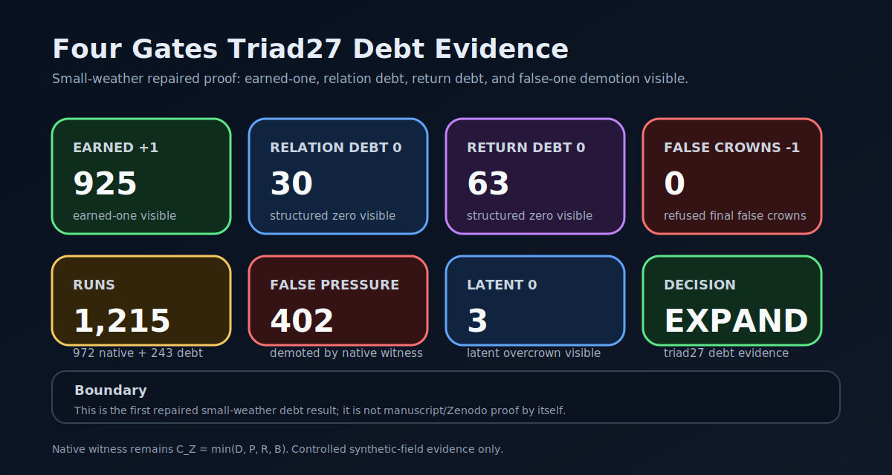
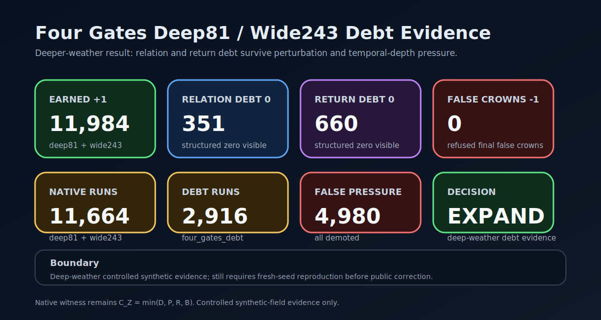
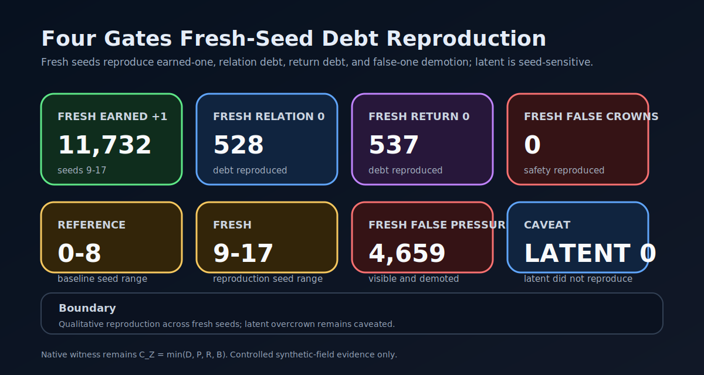

# ZeroGateSim

**Current public line:** `v1.6.27-alpha` — Manuscript Correction Package  
**Status:** speculative research software / controlled synthetic-field experiment line  
**Working identity:** Four Gates of Becoming witness simulator  
**Core question:** can a final trinary witness distinguish earned-one from raw expression pressure, latent overcrown, relation/return debt, and false-one pressure under controlled synthetic-field adversarial weather?

## What ZeroGateSim is

ZeroGateSim is a small research software project for testing a speculative theory of dimensional emergence through a controlled synthetic-field simulator.

It does **not** prove cosmology, physical dimensions, quantum gravity, or that reality itself is trinary.

It tests a narrower software-theory claim:

> Inside controlled synthetic fields, a final trinary witness using the Four Gates of Becoming can preserve earned expression, hold structured zero/debt states, and demote false-one pressure better than raw, binary, dead-safe, and ablated witnesses.

Historical proof records, v1.5 controlled evidence, and the v1.6 shadow route are preserved in the [history vault](docs/history_vault/README.md). They explain how the repo got here; they are not the current README evidence surface.

## Core theory

The central hypothesis is:

> Dimensionality emerges when candidate freedoms pass through the zero-gate cycle of distinction, polarity, relation, and return under trinary temporal ordering.

The four gates are:

- **Distinction** — something becomes separable from background.
- **Polarity** — distinction gains meaningful positive and negative expression around zero.
- **Relation** — polarity becomes bound into stable relation rather than split or drift.
- **Return** — expressed structure folds back toward zero while preserving coherence.

Return is not decorative. Distinction separates. Polarity tensions. Relation binds. When binding becomes coherent, expansion curves back as return.

The zero-gate coherence of candidate `i` at time `t` is:

```math
C_Z^i(t)=\min(g_D^i(t),g_P^i(t),g_R^i(t),g_B^i(t))
```

The minimum matters. A candidate does not pass because one gate is beautiful. The weakest gate decides the coherence pressure.

Core sentence:

> A real one is not the first thing after zero. A real one is what zero can return as without lying.

## Why this exists

The usual ladder of dimensional explanation often begins with:

> point, line, plane, cube, then time.

That ladder may work as a classroom drawing. It does not work as a genesis model. It describes completed structures, not how structure becomes expressible.

ZeroGateSim tests a different spine:

> Time is not merely the fourth room in the house of space. Time is the generative ordering condition through which dimensions become expressed.

The simulator exists because a theory does not earn trust by sounding beautiful. It earns its first bones by meeting pressure.


## How it works

ZeroGateSim tests a simple operational claim: raw expression is pressure, not truth.

A candidate does not become final `+1` merely because it is loud, separable, or locally coherent. It must move through the Four Gates of Becoming and survive a final trinary witness.

```text
Distinction -> Polarity -> Relation -> Return -> final trinary witness
```

The native witness keeps the weakest-gate rule:

```text
C_Z = min(D, P, R, B)
```

where:

- `D` asks whether the candidate separates from background.
- `P` asks whether it has meaningful polarity around zero.
- `R` asks whether polarity binds into relation instead of isolated split or drift.
- `B` asks whether the structure returns through witness pressure while preserving coherence.

The final output is trinary:

```text
+1 earned-one      expression survived the witness stack
 0 structured zero latent, relation debt, return debt, or not-yet pressure is held
-1 resist/demote  false-one pressure is exposed and refused
```

The current evidence route tests that grammar under controlled synthetic adversarial weather:

```text
triad27 = 3^3 local expression weather
deep81  = 3^4 perturbation / late-shock bridge
wide243 = 3^5 temporal-depth / time-axis stress
```

The project compares the native witness against raw, binary, dead-safe, and ablated witnesses. The current bounded claim is that, inside controlled synthetic fields, the Four Gates witness preserved earned expression, held relation/return debt as structured zero, and demoted false-one pressure where simpler witnesses exposed failure modes.

This does not prove cosmology, physical dimensional genesis, quantum gravity, or that reality itself is trinary. It is a computational approximation of zero-zone gating.

## First visual spine

These first three maps are the fastest route into the project. They show mechanism, witness, and test pressure before the README descends into machinery.

### Zero-gate cycle


Native coherence is weakest-gate coherence:

```math
C_Z^i(t)=\min(D_i(t),P_i(t),R_i(t),B_i(t))
```

Raw expression is pressure, not final truth:

```math
\chi^i_{raw}(t)=H(\sigma_i(t)-\epsilon)H(C_Z^i(t)-\theta_Z)
```

### Trinary witness stack


Final earned-one is raw expression after return-depth, lineage, independence, and role-aware witness in the current harness:

```math
\chi^i_{earned}(t)=\chi^i_{raw}(t)H(k_i(t)-K^*)W^i_{lineage}(t)W^i_{independence}(t)W^i_{role}
```

The output grammar is trinary:

```text
+1 earned-one
 0 witness / hold / debt / quarantine / not-yet
-1 resist / reject / false-one demotion
```

### Proof harness map


Weather is trinary, not decimal decoration:

```text
triad27 = 3^3 local expression weather
deep81  = 3^4 perturbation / late-shock bridge
wide243 = 3^5 temporal-depth / time-axis stress
```

The current Four Gates evidence route uses distinction, polarity, relation, and return as dedicated native run families before broader claims are trusted.

## Native math witness

The native math witness remains the spine of the repo. In plain text: `C_Z = min(D, P, R, B)`.

Native anchors:

```math
E_0 = (Z_0, \tau)
```

```math
T_3[X](\tau) = (X(\tau+h)-X(\tau), I_h[X](\tau), X(\tau)-X(\tau-h))
```

```math
L_i = (-e_i, 0, +e_i)
```

```math
\Gamma_i(t)=D_i(t)P_i(t)R_i(t)
```

```math
C_Z^i(t)=\min(D_i(t),P_i(t),R_i(t),B_i(t))
```

```math
\chi^i_{raw}(t)=H(\sigma_i(t)-\epsilon)H(C_Z^i(t)-\theta_Z)
```

```math
\chi^i_{earned}(t)=\chi^i_{raw}(t)H(k_i(t)-K^*)W^i_{lineage}(t)W^i_{independence}(t)W^i_{role}
```

## Active route

The active route after `v1.6.27-alpha` is:

```text
anti-tautology audit complete -> reproduction command package complete -> manuscript correction package complete -> v1.6 closeout -> v1.7 operational claim package
```

The shadow route is **not** the active route now. It is preserved as historical diagnostic work in the [history vault](docs/history_vault/README.md).

Read first:

- [`docs/math_witness_map.md`](docs/math_witness_map.md)
- [`docs/simulation_win_conditions.md`](docs/simulation_win_conditions.md)
- [`docs/controlled_synthetic_field_language.md`](docs/controlled_synthetic_field_language.md) — controlled synthetic-field language boundary.
- [`docs/four_gates_debt_candidate_design.md`](docs/four_gates_debt_candidate_design.md)
- [`docs/four_gates_debt_candidate_generator.md`](docs/four_gates_debt_candidate_generator.md)
- [`docs/four_gates_triad27_debt_evidence.md`](docs/four_gates_triad27_debt_evidence.md)
- [`docs/four_gates_deepwide_debt_evidence.md`](docs/four_gates_deepwide_debt_evidence.md)
- [`docs/four_gates_fresh_seed_debt_reproduction.md`](docs/four_gates_fresh_seed_debt_reproduction.md)
- [`docs/current_evidence_index.md`](docs/current_evidence_index.md)
- [`docs/anti_tautology_audit_plan.md`](docs/anti_tautology_audit_plan.md)
- [`docs/anti_tautology_audit_report.md`](docs/anti_tautology_audit_report.md)
- [`docs/four_gates_reproduction_command_package.md`](docs/four_gates_reproduction_command_package.md)
- [`docs/manuscript_correction_package.md`](docs/manuscript_correction_package.md)
- [`docs/claim_boundary.md`](docs/claim_boundary.md)

## Current evidence state

### Anti-tautology and reproduction boundary

`v1.6.25-alpha` completed the role-dependence check. The honest result is bounded: debt states are witness-counted and reproducible, but the current evidence is still designed-profile / role-shaped rather than independent role-blind discovery.

`v1.6.26-alpha` adds the reproduction command package so a skeptical reader can run a small pipeline smoke, locate canonical heavy evidence, and see the full reference/fresh seed reproduction route before manuscript correction.

`v1.6.27-alpha` adds the manuscript correction package. It prepares section-level patch maps, claim lanes, canonical evidence tables, and a later Zenodo new-version plan without writing the full v2 paper or starting any Zenodo upload.

The recent native evidence line now has the shape the project was trying to reach:

```text
+1 earned-one visible
 0 relation debt visible
 0 return debt visible
-1 false-one pressure visible and demoted
final false-one crowns = 0
```

### Four Gates triad27 debt evidence



`v1.6.20-alpha` showed the repaired small-weather debt pattern:

| lane | count |
|---|---:|
| earned-one | `925` |
| latent overcrown | `3` |
| relation debt | `30` |
| return debt | `63` |
| raw false-one pressure | `402` |
| final false-one crowns | `0` |

### Four Gates deep81 / wide243 debt evidence



`v1.6.21-alpha` pushed the pattern into deeper weather:

| lane | count |
|---|---:|
| earned-one | `11,984` |
| latent overcrown | `18` |
| relation debt | `351` |
| return debt | `660` |
| raw false-one pressure | `4,980` |
| final false-one crowns | `0` |

### Fresh-seed reproduction



`v1.6.22-alpha` reproduced the qualitative pattern on fresh seeds `9-17`:

| lane | reference seeds 0-8 | fresh seeds 9-17 |
|---|---:|---:|
| earned-one | `11,984` | `11,732` |
| relation debt | `351` | `528` |
| return debt | `660` | `537` |
| raw false-one pressure | `4,980` | `4,659` |
| final false-one crowns | `0` | `0` |

Caveat:

```text
latent overcrown reproduced as 18 -> 0, so latent overcrown remains seed-sensitive.
relation debt and return debt did reproduce.
```

### Recent native evidence history

The README keeps only the recent native route because it explains the current evidence surface:

- `v1.6.14-alpha` — native four-gate claim audit;
- `v1.6.15-alpha` — native ablation baselines;
- `v1.6.16-alpha` — four-corpus triad27 native evidence;
- `v1.6.17-alpha` — deep81 / wide243 native evidence with debt lanes partial;
- `v1.6.18-alpha` — Four Gates debt candidate design;
- `v1.6.19-alpha` — Four Gates debt candidate generator;
- `v1.6.20-alpha` — Four Gates triad27 debt evidence;
- `v1.6.21-alpha` — Four Gates deep81 / wide243 debt evidence;
- `v1.6.22-alpha` — Four Gates fresh-seed debt reproduction;
- `v1.6.23-alpha` — history vault and current evidence surface cleanup;
- `v1.6.24-alpha` — How It Works, current evidence index, and v1.6 closeout route lock.
- `v1.6.25-alpha` — Anti-Tautology Audit / Role-Dependence Check;
- `v1.6.26-alpha` — Reproduction Command Package;
- `v1.6.27-alpha` — Manuscript Correction Package.

Older proof and shadow history lives in the history vault.

Boundary:

No Zenodo upload yet, no shadow route revival, no observed-universe bridge, no spacetime metric claim, no new native gate, and no native witness mutation. Native witness remains `C_Z = min(D, P, R, B)`.

## History vault

The history vault keeps what the project was so the README can show what the project is.

- [`docs/history_vault/README.md`](docs/history_vault/README.md) — vault index.
- [`docs/history_vault/shadow_route_history_and_closeout.md`](docs/history_vault/shadow_route_history_and_closeout.md) — full shadow route status.
- [`docs/history_vault/legacy_evidence_visuals.md`](docs/history_vault/legacy_evidence_visuals.md) — old evidence and shadow visuals.
- [`docs/history_vault/runs_history_vault_plan.md`](docs/history_vault/runs_history_vault_plan.md) — local `runs/` archive plan and ZIP command pattern.

## Known-logic comparison boundary

Known logic work began with fuzzy / many-valued, Belnap evidence-state, paraconsistent conflict-locality, and three-valued compression mirrors. This is a projection mirror, not an identity claim.

Allowed:

> Project ZeroGateSim states into fuzzy, Belnap, paraconsistent, Kleene, or Lukasiewicz mirrors to see what is preserved, collapsed, or distorted.

Forbidden:

> ZeroGateSim is identical to any of those logics.

Read:

- [`docs/known_logic_boundary.md`](docs/known_logic_boundary.md)
- [`docs/known_logic_closeout.md`](docs/known_logic_closeout.md)
- [`docs/known_logic_comparison_report.md`](docs/known_logic_comparison_report.md)

## Quickstart

Install/update locally:

```powershell
Set-Location C:\dev\zerogate_sim
$P = ".\.venv\Scripts\python.exe"
& $P -m pip install -e ".[dev]"
& $P -m pytest
```

Run a small demo first:

```powershell
& $P -m zerogate_sim.demo --seed 42 --out runs\demo_seed_42
```

Run the native math invariant tests:

```powershell
& $P -m pytest tests	est_native_math_invariants.py -q
```

Run a current Four Gates debt evidence tool after the required matrix folders exist:

```powershell
& $P -m zerogate_sim.four_gates_fresh_seed_debt_reproduction_report --help
```

More detailed quickstart:

- [`docs/quickstart.md`](docs/quickstart.md)

## Claim boundary

Supported current claim, if the evidence remains intact through package planning:

> Inside controlled synthetic fields, the Four Gates final trinary witness preserved earned-one, held relation/return debt as structured zero, and demoted false-one pressure across triad27, deep81, wide243, and fresh-seed reproduction, while raw, binary, dead-safe, and ablated witnesses exposed visible failure modes.

Unsupported claims:

- this proves physical dimensions;
- this proves cosmology;
- this proves that reality itself is trinary;
- this replaces physics or mathematics;
- this solves role-blind false-one detection;
- this proves an observed-universe bridge.

Read the full boundary:

- [`docs/claim_boundary.md`](docs/claim_boundary.md)

## Paper lineage

Do not overwrite the original theory draft.

The repo preserves two lanes:

- [`docs/papers/history/`](docs/papers/history/) — original pre-simulation manuscript, preserved as historical trace.
- [`docs/papers/zenodo_ready/`](docs/papers/zenodo_ready/) — later simulation-supported manuscript scaffold.

This keeps the lineage honest:

> original seeing -> executable simulation -> proof-of-concept record -> simulation-supported paper -> native math witness lock -> controlled synthetic-field experiments -> Four Gates debt evidence -> claim-boundary repair.

## For reviewers and interested readers

Recommended route:

1. README top card.
2. Claim boundary.
3. Math witness map.
4. Current evidence cards.
5. Four Gates debt reproduction docs.
6. Quickstart or code.
7. History vault only after the current proof boundary is understood.

Reviewer guide:

- [`docs/for_reviewers.md`](docs/for_reviewers.md)

## Boundary and release references

Long release and process lists live in dedicated files so the README begins with the project rather than bookkeeping:

- [`docs/runtime_ci_support.md`](docs/runtime_ci_support.md) — Python/runtime and CI support boundary.
- [`docs/test_truth_and_handoff_boundary.md`](docs/test_truth_and_handoff_boundary.md) — strict assistant handoff, `runs/` evidence, and test-truth rules.
- [`docs/version_truth.md`](docs/version_truth.md) — release spine and recent checkpoints.
- [`docs/release_notes/`](docs/release_notes/) — detailed release notes.

## License and citation

The source repository uses the MIT License.

Citation metadata is stored in [`CITATION.cff`](CITATION.cff). The DOI field is intentionally absent until a Zenodo record exists.

Future manuscript and evidence records may use separate explicit licenses.
