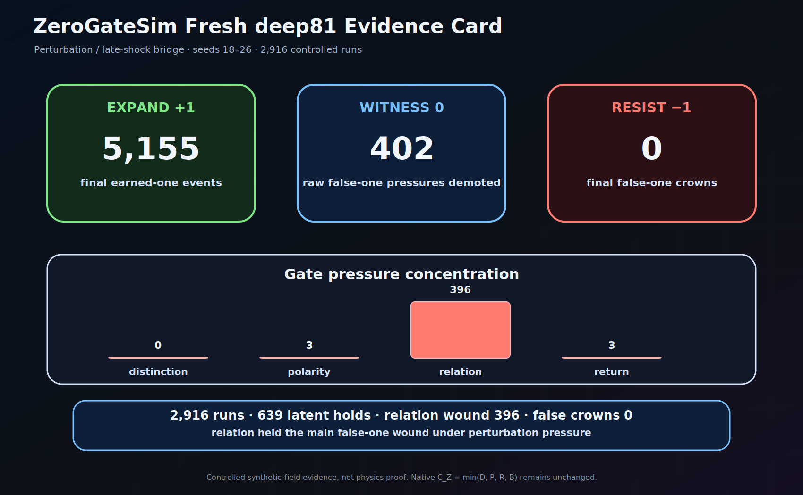
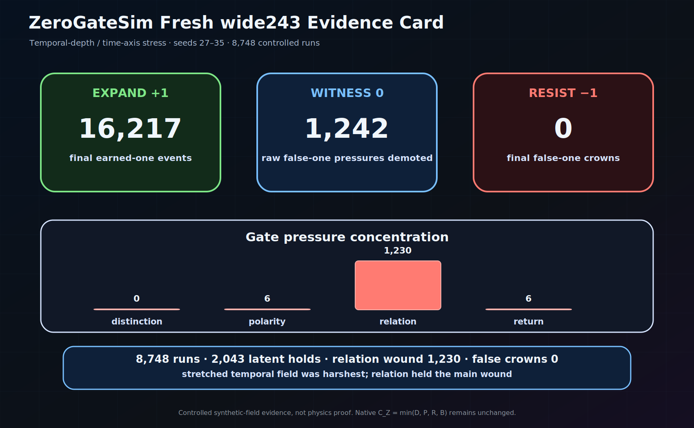

# ZeroGateSim

**Current public line:** `v1.6.15-alpha` — native ablation baselines  
**Status:** speculative research software / controlled synthetic-field experiment line  
**Working identity:** zero-gate dimensional emergence simulator  
**Core question:** can a final trinary witness distinguish earned-one from raw expression pressure, latent overcrown, relation/return debt, and false-one pressure under controlled synthetic-field adversarial weather?

## What ZeroGateSim is

ZeroGateSim is a small research software project for testing a speculative theory of dimensional emergence. The historical first-research-alpha proof record remains a generated toy-field proof-of-concept; the v1.5 line uses controlled synthetic-field language for explicit, seeded, adversarial, bounded experiments; the v1.6 shadow route is now preserved as a historical diagnostic route, not an active claim path.

It does **not** prove cosmology, physical dimensions, or that reality itself is trinary.

It tests a narrower software-theory claim:

> Inside controlled synthetic fields, final earned-one witness can separate earned expression from raw expression pressure, latent overcrown, relation/return debt, and false-one pressure under four-gate adversarial pressure.

## Core theory

The central hypothesis is:

> Dimensionality emerges when candidate freedoms pass through the zero-gate cycle of distinction, polarity, relation, and return under trinary temporal ordering.

The four gates are:

- **Distinction** — something becomes separable from background.
- **Polarity** — distinction gains meaningful positive and negative expression around zero.
- **Relation** — polarity becomes bound into stable relation rather than split or drift.
- **Return** — expressed structure folds back toward zero while preserving coherence.

Return is not decorative. Distinction separates. Polarity tensions. Relation binds. When binding becomes coherent, expansion curves back as return.

The zero-gate coherence of candidate `i` at time `t` is:

```math
C_Z^i(t)=\min(g_D^i(t),g_P^i(t),g_R^i(t),g_B^i(t))
```

The minimum matters. A candidate does not pass because one gate is beautiful. The weakest gate decides the coherence pressure.

Raw local expression is not final `+1`. Final `+1` belongs only to **earned-one**.

Core sentence:

> A real one is not the first thing after zero. A real one is what zero can return as without lying.

## Why this exists

The usual ladder of dimensional explanation often begins with:

> point, line, plane, cube, then time.

That ladder may work as a classroom drawing. It does not work as a genesis model. It describes completed structures, not how structure becomes expressible.

ZeroGateSim tests a different spine:

> Time is not merely the fourth room in the house of space. Time is the generative ordering condition through which dimensions become expressed.

In this frame:

- a point is the zero-zone of dimensional potential;
- a line is polarity around zero;
- a plane is relation between polarities;
- volume is closed relational freedom;
- a dimension is stabilized freedom that has passed through zero without losing coherence.

The simulator exists because a theory does not earn trust by sounding beautiful. It earns its first bones by meeting pressure.

## First visual spine

These first three maps are the fastest route into the project. They show mechanism, witness, and test pressure before the README descends into machinery.

### Zero-gate cycle


Native coherence is weakest-gate coherence:

```math
C_Z^i(t)=\min(D_i(t),P_i(t),R_i(t),B_i(t))
```

Raw expression is pressure, not final truth:

```math
\chi^i_{raw}(t)=H(\sigma_i(t)-\epsilon)H(C_Z^i(t)-\theta_Z)
```

### Trinary witness stack


Final earned-one is raw expression after return-depth, lineage, independence, and role-aware witness in the current harness:

```math
\chi^i_{earned}(t)=\chi^i_{raw}(t)H(k_i(t)-K^*)W^i_{lineage}(t)W^i_{independence}(t)W^i_{role}
```

The output grammar is trinary:

```text
+1 earned-one
 0 witness / hold / quarantine / not-yet
-1 resist / reject / false-one demotion
```

### Proof harness map


Weather is trinary, not decimal decoration:

```text
triad27 = 3^3 local expression weather
deep81  = 3^4 perturbation / late-shock bridge
wide243 = 3^5 temporal-depth / time-axis stress
```

Historical first-alpha used three dedicated adversarial corpora with return measured as native `B`. The current four-gate evidence route includes distinction, polarity, relation, and return as dedicated native run families before broader claims are trusted.

## Native math witness

The native math witness remains the spine of the repo. In plain text: `C_Z = min(D, P, R, B)`.

Native anchors:

```math
E_0 = (Z_0, \tau)
```

```math
T_3[X](\tau) = (X(\tau+h)-X(\tau), I_h[X](\tau), X(\tau)-X(\tau-h))
```

```math
L_i = (-e_i, 0, +e_i)
```

```math
\Gamma_i(t)=D_i(t)P_i(t)R_i(t)
```

```math
C_Z^i(t)=\min(D_i(t),P_i(t),R_i(t),B_i(t))
```

```math
\chi^i_{raw}(t)=H(\sigma_i(t)-\epsilon)H(C_Z^i(t)-\theta_Z)
```

```math
\chi^i_{earned}(t)=\chi^i_{raw}(t)H(k_i(t)-K^*)W^i_{lineage}(t)W^i_{independence}(t)W^i_{role}
```

## Active route

The active route after `v1.6.15-alpha` is:

```text
native ablation baselines -> four-corpus triad27 evidence -> deep81/wide243 native evidence -> fresh-seed reproduction -> manuscript / evidence correction package
```

The shadow route is **not** the active route now. It is preserved as historical diagnostic work because hardened triad27 lane-specific discrimination did not beat simple baselines strongly enough to earn deeper `deep81` / `wide243` trust.

Read first:

- [`docs/math_witness_map.md`](docs/math_witness_map.md)
- [`docs/simulation_win_conditions.md`](docs/simulation_win_conditions.md)
- [`docs/controlled_synthetic_field_language.md`](docs/controlled_synthetic_field_language.md) — controlled synthetic-field language boundary.
- [`docs/four_gate_reconciliation.md`](docs/four_gate_reconciliation.md)
- [`docs/native_four_gate_claim_audit.md`](docs/native_four_gate_claim_audit.md)
- [`docs/native_ablation_baselines.md`](docs/native_ablation_baselines.md)
- [`docs/shadow_route_history_and_closeout.md`](docs/shadow_route_history_and_closeout.md)
- [`docs/claim_boundary.md`](docs/claim_boundary.md)


## Current v1.6.15 gate

`v1.6.15-alpha` defines the native ablation enemies that the repaired witness must beat before the route advances to four-corpus `triad27` evidence.

The test question is:

> Does the final trinary witness preserve earned-one, hold structured zero pressure, and demote false-one pressure better than raw, binary, and ablated alternatives?

Baseline enemies now include:

- dead-safe no-crown;
- raw-expression-only;
- binary raw-or-fail;
- no-zero-hold;
- no-false-one-demotion;
- no-echo-independence;
- no-return-debt witness;
- no-relation-gate raw;
- no-return-gate raw;
- average-gate raw.

Read: [`docs/native_ablation_baselines.md`](docs/native_ablation_baselines.md).

Boundary:

This is not Zenodo correction yet, not observed-universe bridge work, not shadow revival, and not proof of physical dimensional genesis. It is the enemy set for the next native evidence gate. Native witness remains `C_Z = min(D, P, R, B)`.

## Current evidence state

### First-research-alpha result

ZeroGateSim passed an original proof harness and a fresh-seed reproduction inside generated toy fields.

Combined record:

- `1458` scenario cells;
- `13122` seeded simulation runs;
- `22131` final earned-one events;
- `2388` raw false-one pressures detected and demoted;
- `0` final false-one crowns.

The machine did not prove the universe.

It did something narrower and real:

> it met false one, named it, and refused the crown.

### Fresh controlled deep81 / wide243 evidence

`v1.5.5-alpha` records fresh controlled `deep81` and `wide243` four-gate evidence as controlled synthetic-field reports.

| profile | role in ladder | runs | earned-one events | raw false-one pressure | latent overcrown pressure | final false-one crowns |
|---|---|---:|---:|---:|---:|---:|
| `deep81` | perturbation / late-shock bridge | `2,916` | `5,155` | `402` | `639` | `0` |
| `wide243` | temporal-depth / time-axis stress | `8,748` | `16,217` | `1,242` | `2,043` | `0` |

Both runs passed with pressure visible, false-one pressure demoted, latent pressure held, and no final false-one crowns. These are controlled synthetic-field evidence witnesses, not physics proof.

Reports:

- [`docs/reports/fresh_controlled_deep81_four_gate_evidence_report.md`](docs/reports/fresh_controlled_deep81_four_gate_evidence_report.md)
- [`docs/reports/fresh_controlled_wide243_four_gate_evidence_report.md`](docs/reports/fresh_controlled_wide243_four_gate_evidence_report.md)
- [`docs/reports/fresh_controlled_81_243_visual_source.csv`](docs/reports/fresh_controlled_81_243_visual_source.csv)

Historical intake note: `v1.5.4-alpha` preserved the old `wide243` proof floor before the fresh controlled reports. Read [`docs/reports/wide243_historical_evidence_intake.md`](docs/reports/wide243_historical_evidence_intake.md). Native witness remains `C_Z = min(D, P, R, B)`. No new native gate is introduced by these reports.

### Shadow route historical status

The `v1.6.0-alpha` through `v1.6.12-alpha` role-stripped shadow route produced useful tooling and a stronger testing form, but it did not earn the scientific claim it was built to test.

Current historical verdict:

```text
native four-gate witness: standing
role-stripped shadow density signal: partially visible
role-stripped relation / return / demotion specificity: not earned
shadow route status: diagnostic history / HOLD
```

The shadow route is not active evidence for role-blind false-one discovery. Its details live in [`docs/shadow_route_history_and_closeout.md`](docs/shadow_route_history_and_closeout.md), not in the README or roadmap surface.

Historical shadow route document index:

- `v1.6.0-alpha` — [`docs/role_blind_shadow_design.md`](docs/role_blind_shadow_design.md), [`docs/role_blind_shadow_schema.json`](docs/role_blind_shadow_schema.json)
- `v1.6.1-alpha` — Role-stripped feature extraction: [`docs/role_stripped_feature_extraction.md`](docs/role_stripped_feature_extraction.md)
- `v1.6.2-alpha` — [`docs/transparent_shadow_score.md`](docs/transparent_shadow_score.md) — transparent shadow score, not a role-blind detector yet
- `v1.6.3-alpha` — baseline/falsifier: [`docs/shadow_baseline_falsifier.md`](docs/shadow_baseline_falsifier.md)
- `v1.6.4-alpha` — [`docs/four_gate_reconciliation.md`](docs/four_gate_reconciliation.md)
- `v1.6.5-alpha` — [`docs/shadow_holdout_evaluation.md`](docs/shadow_holdout_evaluation.md)
- `v1.6.6-alpha` — [`docs/shadow_triad27_preflight.md`](docs/shadow_triad27_preflight.md)
- `v1.6.7-alpha` — weather hardening: [`docs/shadow_weather_hardening.md`](docs/shadow_weather_hardening.md)
- `v1.6.8-alpha` — [`docs/shadow_triad27_hardened_evidence.md`](docs/shadow_triad27_hardened_evidence.md)
- `v1.6.9-alpha` — [`docs/shadow_discrimination_repair.md`](docs/shadow_discrimination_repair.md)
- `v1.6.10-alpha` — [`docs/shadow_lane_discrimination.md`](docs/shadow_lane_discrimination.md), [`docs/runs_cleanup_policy.md`](docs/runs_cleanup_policy.md)
- `v1.6.11-alpha` — [`docs/shadow_route_audit_and_feature_design.md`](docs/shadow_route_audit_and_feature_design.md)
- `v1.6.12-alpha` — [`docs/shadow_feature_implementation.md`](docs/shadow_feature_implementation.md)

These links are historical references. Shadow result visuals and result tables do not belong on the README surface.

## Evidence visuals

### First-research-alpha proof card


### Fresh controlled deep81 evidence card



### Fresh controlled wide243 evidence card



Visual guide:

- [`docs/visual_guide.md`](docs/visual_guide.md)
- [`docs/share_ready_reader_path.md`](docs/share_ready_reader_path.md)

## Known-logic comparison boundary

Known logic work has begun with fuzzy / many-valued, Belnap evidence-state, paraconsistent conflict-locality, and three-valued compression mirrors. This is a projection mirror, not an identity claim.

Allowed:

> Project ZeroGateSim states into fuzzy, Belnap, paraconsistent, Kleene, or Lukasiewicz mirrors to see what is preserved, collapsed, or distorted.

Forbidden:

> ZeroGateSim is identical to any of those logics.

Read:

- [`docs/known_logic_boundary.md`](docs/known_logic_boundary.md)
- [`docs/known_logic_closeout.md`](docs/known_logic_closeout.md)
- [`docs/known_logic_comparison_report.md`](docs/known_logic_comparison_report.md)

## Quickstart

Install/update locally:

```powershell
Set-Location C:\dev\zerogate_sim
$P = ".\.venv\Scripts\python.exe"
& $P -m pip install -e ".[dev]"
& $P -m pytest
```

Run a small demo first:

```powershell
& $P -m zerogate_sim.demo --seed 42 --out runs\demo_seed_42
```

Run the native math invariant tests:

```powershell
& $P -m pytest tests\test_native_math_invariants.py -q
```

Run the original proof harness:

```powershell
& $P -m zerogate_sim.proof --profile wide243 --start-seed 0 --count 9 --out runs\proof_wide243_0_8_v033
& $P -m zerogate_sim.proof_record --proof-dir runs\proof_wide243_0_8_v033
```

Run the fresh-seed reproduction:

```powershell
& $P -m zerogate_sim.proof --profile wide243 --start-seed 9 --count 9 --out runs\proof_wide243_9_17_repro
& $P -m zerogate_sim.proof_record --proof-dir runs\proof_wide243_9_17_repro
```

Freeze the combined record:

```powershell
& $P -m zerogate_sim.release_record --proof-dir runs\proof_wide243_0_8_v033 --proof-dir runs\proof_wide243_9_17_repro --out runs\first_research_alpha_v1_0_alpha
```

More detailed quickstart:

- [`docs/quickstart.md`](docs/quickstart.md)

## Claim boundary

Supported claim:

> ZeroGateSim's final trinary witness separated earned-one from raw expression, latent overcrown, and false-one pressure across original and fresh-seed trinary adversarial proof records inside generated toy fields, and across later controlled synthetic-field evidence routes.

Unsupported claims:

- this proves physical dimensions;
- this proves cosmology;
- this proves that reality itself is trinary;
- this replaces physics or mathematics;
- this already validates the model against external many-valued logics;
- this solves role-blind false-one detection.

Read the full boundary:

- [`docs/claim_boundary.md`](docs/claim_boundary.md)

## Paper lineage

Do not overwrite the original theory draft.

The repo preserves two lanes:

- [`docs/papers/history/`](docs/papers/history/) — original pre-simulation manuscript, preserved as historical trace.
- [`docs/papers/zenodo_ready/`](docs/papers/zenodo_ready/) — later simulation-supported manuscript scaffold.

This keeps the lineage honest:

> original seeing -> executable simulation -> proof-of-concept record -> simulation-supported paper -> native math witness lock -> known-logic mirrors -> controlled synthetic-field experiments -> claim-boundary repair.

## For reviewers and interested readers

Recommended route:

1. README top card.
2. Claim boundary.
3. Math witness map.
4. Visual route.
5. Proof card.
6. Quickstart or code.
7. Historical manuscript only after the current proof boundary is understood.

Reviewer guide:

- [`docs/for_reviewers.md`](docs/for_reviewers.md)

## Boundary and release references

Long release and process lists live in dedicated files so the README begins with the project rather than bookkeeping:

- [`docs/runtime_ci_support.md`](docs/runtime_ci_support.md) — Python/runtime and CI support boundary.
- [`docs/test_truth_and_handoff_boundary.md`](docs/test_truth_and_handoff_boundary.md) — strict assistant handoff, `runs/` evidence, and test-truth rules.
- [`docs/version_truth.md`](docs/version_truth.md) — release spine and recent checkpoints.
- [`docs/release_notes/`](docs/release_notes/) — detailed release notes.

## License and citation

The source repository uses the MIT License.

Citation metadata is stored in [`CITATION.cff`](CITATION.cff). The DOI field is intentionally absent until a Zenodo record exists.

Future manuscript and evidence records may use separate explicit licenses.
