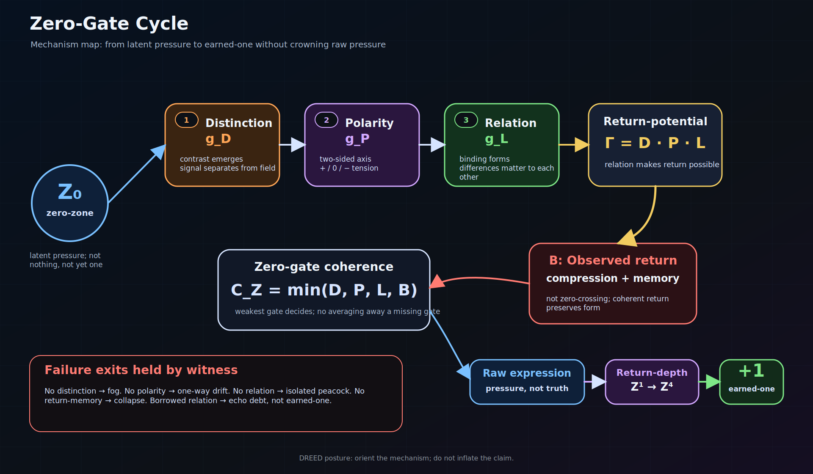
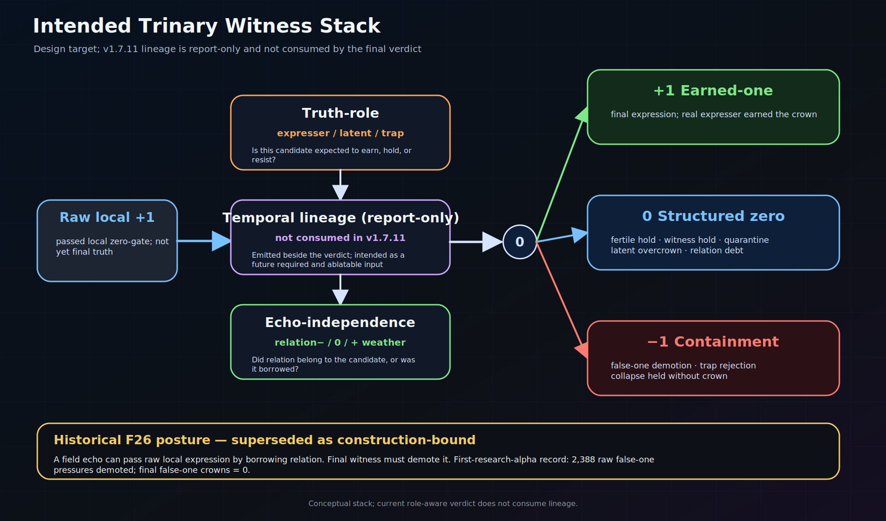
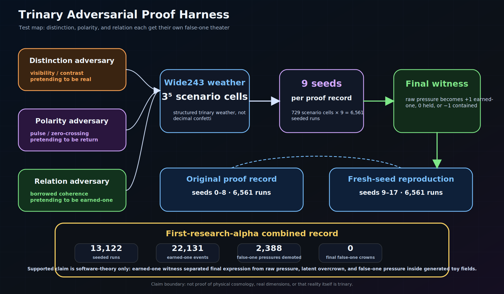

# ZeroGateSim

**Current development line:** `v1.8.1-alpha` — Lineage-Bearing Predictor Package

**Current public line:** `v1.7.11-alpha` — Evidence Integrity Correction

**Scientific authority:** `v1.7.11-alpha`, `0 / HOLD`; speculative research software / controlled synthetic-field experiment line
**Working identity:** Four Gates of Becoming witness simulator  
**Core question:** can a final trinary witness distinguish earned-one from raw expression pressure, latent overcrown, relation/return debt, and false-one pressure under controlled synthetic-field adversarial weather?

## What ZeroGateSim is

ZeroGateSim is a small research software project for testing a speculative theory of dimensional emergence through a controlled synthetic-field simulator.

It does **not** prove cosmology, physical dimensions, quantum gravity, or that reality itself is trinary.

It tests a narrower software-theory claim:

> The legacy role-aware controlled harness reproducibly partitions its designed earned, debt, and false-pressure lanes. Whether a frozen role-free witness can discriminate those structures remains open.

`v1.7.11-alpha` reopens the v1.7 core question at `0 / HOLD`. `v1.7.10-alpha` remains reproducible history, but its zero-false-crown result is construction-bound and its pooled rung totals are nested arithmetic sums, not independent empirical evidence. Read the [Evidence Integrity Correction](docs/v1_7_11_evidence_integrity_correction.md).

`v1.8.0-alpha` is a local software repair checkpoint, not a new scientific
result. It defines an exact observable-only input surface, freezes and hashes
predictions before label join, and uses synthetic invariance tests to keep
prediction bytes unchanged under label permutation and identifier renaming.
Separate evaluator canaries count injected false crowns and reject constant
refusal. Read the [Observable Schema and Label Firewall](docs/v1_8_observable_schema_label_firewall.md).

`v1.8.1-alpha` implements an exact three-frame **prior-touch support** path:
every case is an ordered early/witness/late sequence whose seven fields derive
from, and hash-bind, the v1.8.0 observable schema. The score caps late owned
pressure by the stronger earlier touch. It does not claim continuous
persistence; `.9 -> 0 -> .9` is explicitly allowed as dormant reappearance.
Predictor execution is loaded from the verified source-byte snapshot, and a
strict post-freeze verifier recomputes the score artifacts. Source manifests
constrain inputs to an allowed root, but their no-label/no-holdout declarations
remain content-bound declarations rather than external proof. This is still
development infrastructure: no scientific threshold or holdout label is
selected.

The corrected accounting pass is bound to five exact candidate corpora, the
27/81/243 scenario grids, and seeds 18-26 under a recorded contract hash. Final
counts are recomputed from typed gate rows; caller-selected mini-contracts
cannot issue authoritative unique-union totals.

## How to read this README

Read this page in order. The latest holdout cards are important, but they come **after** the mechanism because a reader should know what the cards witness before seeing the result.

```text
identity -> core theory -> why this exists -> software mechanism -> visual spine -> math witness -> current route -> latest evidence cards -> reviewer package -> inspection paths
```

Detailed ledgers live behind markdown paths so the README stays human-readable without hiding the evidence trail.

## Core theory

The central hypothesis is:

> Dimensionality emerges when candidate freedoms pass through the zero-gate cycle of distinction, polarity, relation, and return under trinary temporal ordering.

The four gates are:

- **Distinction** — something becomes separable from background.
- **Polarity** — distinction gains meaningful positive and negative expression around zero.
- **Relation** — polarity becomes bound into stable relation rather than split or drift.
- **Return** — expressed structure folds back toward zero while preserving coherence.

Return is not decorative. Distinction separates. Polarity tensions. Relation binds. When binding becomes coherent, expansion curves back as return.

The zero-gate coherence of candidate `i` at time `t` is:

```math
C_Z^i(t)=\min(g_D^i(t),g_P^i(t),g_R^i(t),g_B^i(t))
```

The minimum matters. A candidate does not pass because one gate is beautiful. The weakest gate decides the coherence pressure.

Core sentence:

> A real one is not the first thing after zero. A real one is what zero can return as without lying.

## Why this exists

The usual ladder of dimensional explanation often begins with:

> point, line, plane, cube, then time.

That ladder may work as a classroom drawing. It does not work as a genesis model. It describes completed structures, not how structure becomes expressible.

ZeroGateSim tests a different spine:

> Time is not merely the fourth room in the house of space. Time is the generative ordering condition through which dimensions become expressed.

The simulator exists because a theory does not earn trust by sounding beautiful. It earns its first bones by meeting pressure.

## How it works

ZeroGateSim tests a simple operational claim: raw expression is pressure, not truth.

A candidate does not become final `+1` merely because it is loud, separable, or locally coherent. It must move through the Four Gates of Becoming and survive a final trinary witness.

```text
Distinction -> Polarity -> Relation -> Return -> final trinary witness
```

The native witness keeps the weakest-gate rule:

```text
C_Z = min(D, P, R, B)
```

where:

- `D` asks whether the candidate separates from background.
- `P` asks whether it has meaningful polarity around zero.
- `R` asks whether polarity binds into relation instead of isolated split or drift.
- `B` asks whether the structure returns through witness pressure while preserving coherence.

The final output is trinary:

```text
+1 earned-one      expression survived the witness stack
 0 structured zero latent, relation debt, return debt, or not-yet pressure is held
-1 resist/demote  false-one pressure is exposed and refused
```

The project compares the native witness against raw, binary, dead-safe, and ablated witnesses. The current bounded claim is narrower: inside controlled synthetic fields, the legacy role-aware harness reproducibly partitions its designed earned, debt, and false-pressure lanes. Whether a frozen role-free witness outperforms simpler baselines remains open.

This does not prove cosmology, physical dimensional genesis, quantum gravity, or that reality itself is trinary. It is a computational approximation of zero-zone gating.

## First visual spine

These first three maps are the fastest route into the project. They show mechanism, witness, and test pressure before the README descends into machinery.

### Zero-gate cycle



Native coherence is weakest-gate coherence:

```math
C_Z^i(t)=\min(D_i(t),P_i(t),R_i(t),B_i(t))
```

Raw expression is pressure, not final truth:

```math
\chi^i_{raw}(t)=H(\sigma_i(t)-\epsilon)H(C_Z^i(t)-\theta_Z)
```

### Intended trinary witness stack



This diagram preserves the intended witness design, not an exact v1.7.11 code
trace. The equation below is a target contract. In the current implementation,
`earned_one.build_earned_one_rows` consumes truth role and echo-independence;
lineage artifacts are written beside the verdict but are not consumed by it.

```math
\chi^i_{earned}(t)=\chi^i_{raw}(t)H(k_i(t)-K^*)W^i_{lineage}(t)W^i_{independence}(t)W^i_{role}
```

The output grammar is trinary:

```text
+1 earned-one
 0 witness / hold / debt / quarantine / not-yet
-1 resist / reject / false-one demotion
```

### Proof harness map



Weather is trinary, not decimal decoration:

```text
triad27 = 3^3 local expression weather
deep81  = 3^4 perturbation / late-shock bridge
wide243 = 3^5 temporal-depth / time-axis stress
```

The current Four Gates evidence route uses distinction, polarity, relation, and return as dedicated native run families before broader claims are trusted.

## Native math witness

The native math witness remains the spine of the repo. In plain text: `C_Z = min(D, P, R, B)`.

Native anchors:

```math
E_0 = (Z_0, \tau)
```

```math
T_3[X](\tau) = (X(\tau+h)-X(\tau), I_h[X](\tau), X(\tau)-X(\tau-h))
```

```math
L_i = (-e_i, 0, +e_i)
```

```math
\Gamma_i(t)=D_i(t)P_i(t)R_i(t)
```

```math
C_Z^i(t)=\min(D_i(t),P_i(t),R_i(t),B_i(t))
```

```math
\chi^i_{raw}(t)=H(\sigma_i(t)-\epsilon)H(C_Z^i(t)-\theta_Z)
```

The next equation is the intended earned-one design, not the exact implemented
v1.7.11 decision path; lineage is currently report-only.

```math
\chi^i_{earned}(t)=\chi^i_{raw}(t)H(k_i(t)-K^*)W^i_{lineage}(t)W^i_{independence}(t)W^i_{role}
```

## Current route

The active route after the v1.7.11 correction is:

```text
v1.7.0-alpha core question contract complete
-> v1.7.1-alpha return gate trace lock complete
-> v1.7.2-alpha Lane Taxonomy and Latent Overcrown Repair complete
-> v1.7.3-alpha Baseline and Ablation Falsifier Matrix complete
-> v1.7.4-alpha Perturbation Spectrum Witness complete
-> v1.7.5-alpha Masked Role-Dependence Audit complete
-> v1.7.6-alpha Fresh Holdout Synthetic-Field Challenge complete
-> v1.7.7-alpha Anti-Tautology Audit / Role-Dependence Check complete
-> v1.7.8-alpha repo cleanup / cohesion check complete
-> v1.7.9-alpha reviewer start here / reproduction package complete
-> v1.7.10-alpha historical core question closeout superseded
-> v1.7.11-alpha evidence integrity correction: released scientific authority, 0 / HOLD
-> v1.8.0-alpha observable schema and label firewall: local software checkpoint green
-> v1.8.1-alpha lineage-bearing predictor package: local development checkpoint
-> next: v1.8.2 development-only threshold selection and falsifier evaluation
```

The shadow route is **not** the active route now. It is preserved as historical diagnostic work in the [history vault](docs/history_vault/README.md).

## Latest evidence snapshot — visual cards

The latest v1.7 local holdout snapshot is displayed here after the theory and mechanism so the cards have context. It is **not** the reviewer reproduction package and **does not** close the core question.

The three rungs were inspected separately:

```text
triad27 -> inspect -> deep81 -> inspect -> wide243 -> inspect -> package later
```

### triad27 — local expression weather


### deep81 — perturbation / late-shock bridge


### wide243 — temporal-depth / time-axis stress


### historical combined witness read — invalid as unique pooled evidence


```text
historical nested opportunity sum = 375,921  (invalid pooled evidence)
unique atomic union               = 260,253  (wide243 contains the narrow slices)
duplicate representations        = 115,668

unique-union role-aware counts:
earned-one                        = 9,417
raw expression pressure           = 14,058
false-one pressure                = 3,543
final false-one crowns            = 0  (construction-bound; not a blind result)
```

Read the bounded snapshot and output-structure contract:

- [`docs/v1_7_latest_holdout_snapshot.md`](docs/v1_7_latest_holdout_snapshot.md)
- [`docs/v1_7_holdout_output_structure.md`](docs/v1_7_holdout_output_structure.md)


## Reviewer start here / reproduction package

`v1.7.9-alpha` remains the historical reproduction door. `v1.7.11-alpha` changes how those artifacts may be interpreted: reproduction confirms the role-aware harness and supplies inputs to the integrity audit; it does not reproduce blind discrimination.

Start here:

- [`REVIEWER_START_HERE.md`](REVIEWER_START_HERE.md) — human entry path, read order, run order, and stop conditions.
- [`docs/v1_7_minimal_reproduction.md`](docs/v1_7_minimal_reproduction.md) — smallest safe smoke/reproduction path.
- [`docs/v1_7_expected_outputs.md`](docs/v1_7_expected_outputs.md) — expected full output, compressed summary, visual, machine, and handoff layers.
- [`docs/v1_7_claim_boundary_card.md`](docs/v1_7_claim_boundary_card.md) — allowed and forbidden claim language before closeout.
- [`docs/v1_7_evidence_manifest.md`](docs/v1_7_evidence_manifest.md) — package-facing evidence manifest.
- [`scripts\run_v1_7_small_reproduction.ps1`](scripts/run_v1_7_small_reproduction.ps1) — small reviewer package smoke script.
- [`docs/v1_7_reviewer_reproduction_package.md`](docs/v1_7_reviewer_reproduction_package.md) — package contract and command-generation route.
- [`docs/v1_7_reproduction_run_order.md`](docs/v1_7_reproduction_run_order.md) — `triad27 -> inspect -> deep81 -> inspect -> wide243 -> inspect`.
- [`docs/v1_7_reviewer_evidence_manifest.md`](docs/v1_7_reviewer_evidence_manifest.md) — current evidence surfaces used by the package.
- [`docs/v1_7_reproduction_expected_outputs.md`](docs/v1_7_reproduction_expected_outputs.md) — extended output-layer trace.

Safe run order:

```text
smoke -> triad27 -> inspect -> deep81 -> inspect -> wide243 -> atomic overlap audit -> v1.7.11 HOLD
```

The combined package is navigation only. It must not replace the separate rung records.

## Evidence Integrity Correction

`v1.7.11-alpha` supersedes the active authority of the v1.7.10 closeout and returns the core question to `0 / HOLD`.

The v1.7.10 card remains a historical artifact, not the current project decision.

Correction sentence:

> v1.7.11-alpha reopens the core question at 0/HOLD: the current path uses truth role, lineage is not consumed by the final verdict, and the weather rungs are nested views. The surviving claim is reproducible role-aware harness behavior, not blind empirical discrimination.

Boundary remains strict:

```text
role-free scientific discrimination = not demonstrated
prior-touch scorer kernel = implemented; continuous persistence is not claimed
prior-touch support in final verdict = not implemented
independent generator validation = not done
manuscript v2 / DTA transfer = HOLD
v1.8.0 movement = callback-argument/schema and hash-integrity firewall local green
v1.8.1 movement = verified three-frame prior-touch package without threshold selection
next checkpoint = v1.8.2 development-only threshold selection and falsifiers
```

Read:

- [`docs/v1_7_11_evidence_integrity_correction.md`](docs/v1_7_11_evidence_integrity_correction.md)
- [`docs/v1_7_core_question_closeout.md`](docs/v1_7_core_question_closeout.md) — historical closeout, superseded.
- [`docs/v1_7_go_no_go_for_manuscript_v2.md`](docs/v1_7_go_no_go_for_manuscript_v2.md) — current decision is HOLD.

## Observable Schema and Label Firewall

`v1.8.0-alpha` closes the first repair gate without pretending to close the
scientific question. The predictor receives exactly these seven finite values:

```text
strength
distinction
polarity
relation
return_observed
echo_mimic_score
observed_stability_score
```

Every missing or extra field fails closed. Source identifiers and hash-bound
join identifiers remain outside the callback. Prediction bytes, their manifest,
and a pre-label receipt are written before the separate evaluation path may
load the label artifact. Label permutation and identifier renaming leave
prediction bytes invariant; deliberate false crowns and constant predictors
remain visible failures.

This earns only `LOCAL_GREEN_FIREWALL_ONLY`. It does not supply a scientific
scorer, choose thresholds, reveal a frozen holdout, validate an unseen
generator family, start manuscript v2, or authorize DTA transfer.

Run the synthetic infrastructure canary:

```powershell
.\.venv\Scripts\python.exe -m zerogate_sim.v1_8_observable_schema_label_firewall `
  --out runs\v1_8_observable_schema_label_firewall_local
```

Read:

- [`docs/v1_8_observable_schema_label_firewall.md`](docs/v1_8_observable_schema_label_firewall.md) — exact schema, freeze order, adversarial controls, and limitations.
- [`docs/manuscript_v2_empirical_readiness_gate.md`](docs/manuscript_v2_empirical_readiness_gate.md) — the evidence gate that must be earned before manuscript prose begins.
- [`docs/UNIVERSAL_CODING_WORKFLOW_v3_CODEX_PROJECT.md`](docs/UNIVERSAL_CODING_WORKFLOW_v3_CODEX_PROJECT.md) — includes the permanent Coding Economics split between agent work and safe manual work.

## Lineage-Bearing Predictor Package

`v1.8.1-alpha` uses three ordered frames rather than pretending one snapshot is
a temporal path:

```text
early -> witness -> late
```

Each frame derives from the v1.8.0 seven-field allowlist and binds the base
schema ID and hash. The predictor computes minimum owned pressure per frame,
then limits the late score by the strongest earlier touch. The no-prior-touch
ablation uses late pressure alone. Synthetic canaries require sustained
pressure to outrank a one-frame late spike under the full predictor, with that
ranking reversed when prior-touch support is removed.

This is not a continuity operator. A strong early frame, low witness frame, and
strong late frame is accepted as dormant reappearance. The package executes
the scorer from verified source bytes, requires an allowed-root source
manifest, and strictly recomputes and verifies the freeze before downstream
use. The source declarations are not proof of unrestricted local history.

The byte-bound v1.8.2 method requires four generator lineages, nested
leave-one-lineage-out folds, exact threshold boundaries, a deterministic
lexicographic objective, simple and constant baselines, frozen and retuned
ablations, lineage-cluster uncertainty, duplicate/aliasing controls, and
fail-closed stops.

The predictor callback and score-freeze path are threshold-free and label-free;
their source declarations remain declarations rather than external proof. Read
[`docs/v1_8_1_lineage_predictor_package.md`](docs/v1_8_1_lineage_predictor_package.md)
for the exact formula, package binding, plan lock, and limitations.

As workflow research, the user has authorized Codex to execute the planned
v1.8.2-through-v1.8.4 sequence end to end, including development threshold
selection, holdout freeze/join, commits, push, PRs, CI repair, and merges. This
does not pre-authorize a positive result: locked `INVALID`, `HOLD`, or
`FALSIFIED` outcomes remain controlling. Tags/releases, DTA transfer,
manuscript prose, Zenodo, and email remain forbidden. See the
[`workflow research ledger`](docs/workflow_research_ledger.md).

## Inspection map

The README keeps the project face, the math, and the newest visual cards. Everything that became too long for the front page still has a visible path.

### Reviewer package

- [`REVIEWER_START_HERE.md`](REVIEWER_START_HERE.md) — narrow reviewer door.
- [`docs/v1_7_reviewer_reproduction_package.md`](docs/v1_7_reviewer_reproduction_package.md) — package contract.
- [`docs/v1_7_reproduction_run_order.md`](docs/v1_7_reproduction_run_order.md) — separate-rung order.
- [`docs/v1_7_reviewer_evidence_manifest.md`](docs/v1_7_reviewer_evidence_manifest.md) — evidence path manifest.
- [`docs/v1_7_reproduction_expected_outputs.md`](docs/v1_7_reproduction_expected_outputs.md) — output layer contract.

### Current scientific authority and v1.8 repair

- [`docs/v1_7_11_evidence_integrity_correction.md`](docs/v1_7_11_evidence_integrity_correction.md) — current `0 / HOLD` decision and executable correction.
- [`docs/current_evidence_state.md`](docs/current_evidence_state.md) — detailed v1.7 evidence state and boundaries.
- [`docs/v1_7_latest_holdout_snapshot.md`](docs/v1_7_latest_holdout_snapshot.md) — three-rung holdout snapshot behind the visual cards.
- [`docs/v1_7_holdout_weather_ladder.md`](docs/v1_7_holdout_weather_ladder.md) — why triad27 / deep81 / wide243 are separate rungs.
- [`docs/v1_7_holdout_output_structure.md`](docs/v1_7_holdout_output_structure.md) — full report, compressed summary, visual output, and handoff layers.
- [`docs/v1_7_front_page_map.md`](docs/v1_7_front_page_map.md) — why the README is ordered this way.
- [`docs/current_evidence_index.md`](docs/current_evidence_index.md) — current evidence index.
- [`docs/version_truth.md`](docs/version_truth.md) — version spine and release truth.
- [`docs/v1_7_core_question_closeout.md`](docs/v1_7_core_question_closeout.md) — historical v1.7.10 closeout, superseded.
- [`docs/v1_7_answer_status_card.md`](docs/v1_7_answer_status_card.md) — historical trinary answer state, superseded.
- [`docs/v1_7_closeout_claim_boundary.md`](docs/v1_7_closeout_claim_boundary.md) — historical post-closeout language, superseded.
- [`docs/v1_7_go_no_go_for_manuscript_v2.md`](docs/v1_7_go_no_go_for_manuscript_v2.md) — current manuscript HOLD and local repair route.
- [`REVIEWER_START_HERE.md`](REVIEWER_START_HERE.md) — narrow reviewer door and reproduction route.
- [`docs/v1_7_reviewer_reproduction_package.md`](docs/v1_7_reviewer_reproduction_package.md) — reviewer package contract.
- [`docs/v1_7_reproduction_commands.md`](docs/v1_7_reproduction_commands.md) — separate rung command map.
- [`docs/v1_7_expected_outputs.md`](docs/v1_7_expected_outputs.md) — expected output and handoff layers.
- [`docs/v1_7_evidence_manifest.md`](docs/v1_7_evidence_manifest.md) — package evidence manifest.
- [`docs/v1_7_claim_boundary_card.md`](docs/v1_7_claim_boundary_card.md) — current `0 / HOLD` claim boundary.

### Current v1.8 software repair

- [`docs/v1_8_observable_schema_label_firewall.md`](docs/v1_8_observable_schema_label_firewall.md) — local-green firewall contract and honest limits.
- [`docs/v1_8_1_lineage_predictor_package.md`](docs/v1_8_1_lineage_predictor_package.md) — exact three-frame prior-touch score, package binding, verifier, and limitations.
- [`docs/manuscript_v2_empirical_readiness_gate.md`](docs/manuscript_v2_empirical_readiness_gate.md) — manuscript timing and decision gate.
- [`docs/release_notes/v1_8_0_alpha.md`](docs/release_notes/v1_8_0_alpha.md) — version-local change record.
- [`docs/release_notes/v1_8_1_alpha.md`](docs/release_notes/v1_8_1_alpha.md) — lineage-package change record.
- [`docs/workflow_research_ledger.md`](docs/workflow_research_ledger.md) — end-to-end Codex economics observations.

### Anti-tautology / role-dependence path

The post-holdout anti-tautology and role-dependence check is inspectable before reviewer packaging:

- [`docs/v1_7_anti_tautology_role_dependence_check.md`](docs/v1_7_anti_tautology_role_dependence_check.md)
- [`docs/v1_7_anti_tautology_known_routine.md`](docs/v1_7_anti_tautology_known_routine.md)
- [`docs/v1_7_post_holdout_audit_schema.md`](docs/v1_7_post_holdout_audit_schema.md)

The check follows a known sanity routine:

```text
pre-register expectations
-> hold out fresh cases
-> keep positive controls active
-> keep negative controls active
-> mask labels / role-name leakage
-> compare against simpler explanations
-> explain the decision path
-> bound the claim
```

### Recent native evidence history

Recent native evidence history is still in sight, but it no longer crowds the README body:

- [`docs/recent_native_evidence_history.md`](docs/recent_native_evidence_history.md)
- [`docs/native_triad27_evidence.md`](docs/native_triad27_evidence.md)
- [`docs/native_deepwide_evidence.md`](docs/native_deepwide_evidence.md)
- [`docs/four_gates_triad27_debt_evidence.md`](docs/four_gates_triad27_debt_evidence.md)
- [`docs/four_gates_deepwide_debt_evidence.md`](docs/four_gates_deepwide_debt_evidence.md)
- [`docs/four_gates_fresh_seed_debt_reproduction.md`](docs/four_gates_fresh_seed_debt_reproduction.md)

Previous native evidence card assets remain traceable:

- `docs/assets/four_gates_triad27_debt_evidence_card.svg`
- `docs/assets/four_gates_deepwide_debt_evidence_card.svg`
- `docs/assets/four_gates_fresh_seed_debt_reproduction_card.svg`

### History vault

The history vault keeps what the project was so the README can show what the project is.

- [`docs/history_vault/README.md`](docs/history_vault/README.md) — vault index.
- [`docs/history_vault/shadow_route_history_and_closeout.md`](docs/history_vault/shadow_route_history_and_closeout.md) — full shadow route status.
- [`docs/history_vault/legacy_evidence_visuals.md`](docs/history_vault/legacy_evidence_visuals.md) — old evidence and shadow visuals.
- [`docs/history_vault/runs_history_vault_plan.md`](docs/history_vault/runs_history_vault_plan.md) — local `runs/` archive plan and ZIP command pattern.

### Boundary and release references

Long release and process lists live in dedicated files so the README begins with the project rather than bookkeeping:

- [`docs/claim_boundary.md`](docs/claim_boundary.md) — supported and unsupported claims.
- [`docs/runtime_ci_support.md`](docs/runtime_ci_support.md) — Python/runtime and CI support boundary.
- [`docs/test_truth_and_handoff_boundary.md`](docs/test_truth_and_handoff_boundary.md) — strict assistant handoff, `runs/` evidence, and test-truth rules.
- [`docs/controlled_synthetic_field_language.md`](docs/controlled_synthetic_field_language.md) — controlled synthetic-field wording.
- [`docs/release_notes/`](docs/release_notes/) — detailed release notes.

## Current evidence state

The detailed evidence state is now in [`docs/current_evidence_state.md`](docs/current_evidence_state.md). The recent native evidence history is in [`docs/recent_native_evidence_history.md`](docs/recent_native_evidence_history.md). Older proof and shadow history lives in the history vault. The controlled synthetic-field language boundary lives at [`docs/controlled_synthetic_field_language.md`](docs/controlled_synthetic_field_language.md).

The current front-page route preserves the v1.6/v1.7 release spine as trace anchors, not as the main visual surface:

```text
anti-tautology audit complete -> reproduction command package complete -> manuscript correction package complete -> v1.6 closeout complete
v1.6.14-alpha -> v1.6.15-alpha -> v1.6.16-alpha -> v1.6.17-alpha -> v1.6.18-alpha -> v1.6.19-alpha -> v1.6.20-alpha -> v1.6.21-alpha -> v1.6.22-alpha -> v1.6.23-alpha -> v1.6.24-alpha -> v1.6.25-alpha -> v1.6.26-alpha -> v1.6.27-alpha -> v1.6.28-alpha
v1.7.0-alpha -> v1.7.1-alpha -> v1.7.2-alpha -> v1.7.3-alpha -> v1.7.4-alpha -> v1.7.5-alpha -> v1.7.6-alpha -> v1.7.7-alpha -> v1.7.8-alpha -> v1.7.9-alpha -> v1.7.10-alpha historical -> v1.7.11-alpha HOLD -> v1.8.0 firewall local green -> v1.8.1 lineage package -> v1.8.2 development selection
```

Named recent gates remain inspectable:

```text
Lane Taxonomy and Latent Overcrown Repair
Baseline and Ablation Falsifier Matrix
Perturbation Spectrum Witness
Masked Role-Dependence Audit
Fresh Holdout Synthetic-Field Challenge
Anti-Tautology Audit / Role-Dependence Check
Repo Cleanup / Cohesion Check
Reviewer Start Here / Reproduction Package
Evidence Integrity Correction / Core Question Reopened
```

Native/repaired evidence phrase anchors preserved for tested public-surface continuity:

```text
four-corpus triad27 native evidence
deep81 / wide243 native evidence
deep81 / wide243 debt evidence
fresh-seed debt reproduction
v1.6 Closeout Decision
```

Boundary:

```text
No Zenodo upload yet for the new v1.7/v2 line.
No shadow route revival.
No observed-universe bridge.
No spacetime metric claim.
No new native gate.
No native witness mutation.
Native witness remains C_Z = min(D, P, R, B).
```

## Known-logic comparison boundary

Known logic work began with fuzzy / many-valued, Belnap evidence-state, paraconsistent conflict-locality, and three-valued compression mirrors. This is a projection mirror, not an identity claim.

Allowed:

> Project ZeroGateSim states into fuzzy, Belnap, paraconsistent, Kleene, or Lukasiewicz mirrors to see what is preserved, collapsed, or distorted.

Forbidden:

> ZeroGateSim is identical to any of those logics.

Read:

- [`docs/known_logic_boundary.md`](docs/known_logic_boundary.md)
- [`docs/known_logic_closeout.md`](docs/known_logic_closeout.md)
- [`docs/known_logic_comparison_report.md`](docs/known_logic_comparison_report.md)

## Quickstart

Install/update locally:

```powershell
Set-Location C:\dev\zerogate_sim
$P = ".\.venv\Scripts\python.exe"
& $P -m pip install -e ".[dev]"
& $P -m pytest
```

Run a small demo first:

```powershell
& $P -m zerogate_sim.demo --seed 42 --out runs\demo_seed_42
```

Run the native math invariant tests:

```powershell
& $P -m pytest tests\test_native_math_invariants.py -q
```

Run a current Four Gates debt evidence tool after the required matrix folders exist:

```powershell
& $P -m zerogate_sim.four_gates_fresh_seed_debt_reproduction_report --help
```

More detailed quickstart:

- [`docs/quickstart.md`](docs/quickstart.md)

## Claim boundary

Supported current claim:

> Inside controlled synthetic fields, the legacy role-aware harness reproducibly partitions its designed earned, debt, and false-pressure lanes. This is construction-bound software behavior and does not yet establish a blind discriminator.

Unsupported claims:

- this proves physical dimensions;
- this proves cosmology;
- this proves that reality itself is trinary;
- this replaces physics or mathematics;
- this solves role-blind false-one detection;
- this establishes a role-free empirical discriminator;
- this earns manuscript v2 or DTA transfer;
- this proves an observed-universe bridge.

Read the full boundary:

- [`docs/claim_boundary.md`](docs/claim_boundary.md)

## Paper lineage

Do not overwrite the original theory draft.

The repo preserves two lanes, both presently historical or gated:

- [`docs/papers/history/`](docs/papers/history/) — original pre-simulation manuscript, preserved as historical trace.
- [`docs/papers/zenodo_ready/`](docs/papers/zenodo_ready/) — historical scaffold; manuscript v2 prose remains blocked by the empirical-readiness gate.

This keeps the lineage honest:

> original seeing -> executable simulation -> proof-of-concept record -> simulation-supported paper -> native math witness lock -> controlled synthetic-field experiments -> Four Gates debt evidence -> claim-boundary repair.

## For reviewers and interested readers

Recommended route:

1. README identity and claim boundary.
2. Core theory and native math witness.
3. First visual spine.
4. How the software witness works.
5. Latest v1.7 holdout cards.
6. Anti-tautology / role-dependence audit path.
7. Reviewer reproduction package.
8. Quickstart or code.
9. History vault only after the current proof boundary is understood.

Reviewer guide:

- [`REVIEWER_START_HERE.md`](REVIEWER_START_HERE.md)
- [`docs/v1_7_reviewer_reproduction_package.md`](docs/v1_7_reviewer_reproduction_package.md)
- [`docs/for_reviewers.md`](docs/for_reviewers.md)

## License and citation

The source repository uses the MIT License.

Citation metadata is stored in [`CITATION.cff`](CITATION.cff). The DOI field is intentionally absent until a Zenodo record exists.

Future manuscript and evidence records may use separate explicit licenses.
