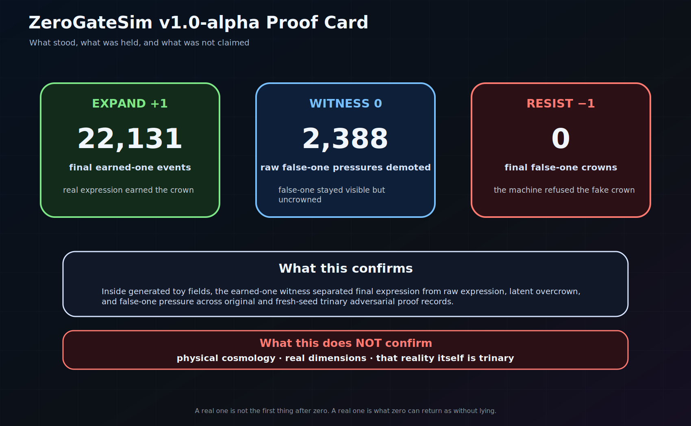

# ZeroGateSim

**Current public line:** `v1.3.0-alpha` — fuzzy / many-valued mirror foundation  
**Status:** speculative research software / toy-field proof-of-concept  
**Working identity:** zero-gate dimensional emergence simulator  
**Core question:** can a final trinary witness distinguish earned-one from raw expression pressure, latent overcrown, and false-one pressure under adversarial toy-field weather?

ZeroGateSim is a small research software project for testing a speculative theory of dimensional emergence.

It does **not** prove cosmology, physical dimensions, or that reality itself is trinary.

It tests a narrower software-theory claim:

> Inside generated toy fields, final earned-one witness can separate earned expression from raw expression pressure, latent overcrown, and false-one pressure across distinction, polarity, and relation adversaries.

## Version truth

The active public line is repaired around this spine:

- `v1.0.x-alpha` — first-research-alpha proof record and public source foundation.
- `v1.1.x-alpha` — share-ready public witness pack.
- `v1.2.x-alpha` — native math witness lock, invariant tests, and scope discipline.
- `v1.3.x-alpha` — known-logic mirrors, beginning with fuzzy / many-valued score comparison.

`v1.2.4-alpha` added a Power-Up / Fail report too early. `v1.2.5-alpha` removed that active machinery and kept the useful question as documentation-only acceptance criteria. `v1.3.0-alpha` begins the known-logic mirror line with fuzzy / many-valued scoring comparison.

## Active route

The current route is:

```text
native geometry -> native math -> code fidelity -> invariant tests -> known logic mirrors -> stronger experiments
```

Do not skip the order. ZeroGateSim is not helped by wearing a borrowed lab coat.

Read first:

- [`docs/math_witness_map.md`](docs/math_witness_map.md)
- [`docs/simulation_win_conditions.md`](docs/simulation_win_conditions.md)
- [`docs/local_tooling_repair.md`](docs/local_tooling_repair.md)
- [`docs/known_logic_boundary.md`](docs/known_logic_boundary.md)
- [`docs/fuzzy_mirror.md`](docs/fuzzy_mirror.md)

## Why this exists

The usual ladder of dimensional explanation often begins with:

> point, line, plane, cube, then time.

That ladder may work as a classroom drawing. It does not work as a genesis model. It describes completed structures, not how structure becomes expressible.

ZeroGateSim tests a different spine:

> Time is not merely the fourth room in the house of space. Time is the generative ordering condition through which dimensions become expressed.

In this frame:

- a point is the zero-zone of dimensional potential;
- a line is polarity around zero;
- a plane is relation between polarities;
- volume is closed relational freedom;
- a dimension is stabilized freedom that has passed through zero without losing coherence.

The simulator exists because a theory does not earn trust by sounding beautiful. It earns its first bones by meeting pressure.

## Native math witness

The v1.2 line asks whether the repository obeys its own native math before comparing itself with external formal logics.

Native anchors:

```math
E_0 = (Z_0, \tau)
```

```math
T_3[X](\tau) = (X(\tau+h)-X(\tau), I_h[X](\tau), X(\tau)-X(\tau-h))
```

```math
L_i = (-e_i, 0, +e_i)
```

```math
\Gamma_i(t)=D_i(t)P_i(t)R_i(t)
```

```math
C_Z^i(t)=\min(D_i(t),P_i(t),R_i(t),B_i(t))
```

```math
\chi^i_{raw}(t)=H(\sigma_i(t)-\epsilon)H(C_Z^i(t)-\theta_Z)
```

```math
\chi^i_{earned}(t)=\chi^i_{raw}(t)H(k_i(t)-K^*)W^i_{lineage}(t)W^i_{independence}(t)W^i_{role}
```

## Known-logic comparison boundary

Known logic work has begun with the fuzzy / many-valued mirror. This is a projection mirror, not an identity claim.

The v1.3.0 fuzzy mirror compares native weakest-gate coherence against product, average, and Lukasiewicz-style continuous conjunctions. It asks where softer aggregation hides a missing gate and where stricter aggregation adds useful pressure.

Allowed:

> Project ZeroGateSim states into fuzzy, Belnap, paraconsistent, Kleene, or Lukasiewicz mirrors to see what is preserved, collapsed, or distorted.

Forbidden:

> ZeroGateSim is identical to any of those logics.

The active mirror order is fuzzy / many-valued scoring first, then Belnap evidence states, then paraconsistent conflict locality, then Kleene / Lukasiewicz compression and loss reporting.


### Fuzzy mirror outputs

Matrix runs now write:

```text
matrix_fuzzy_mirror_trace.csv
matrix_fuzzy_mirror_candidate_summary.csv
matrix_fuzzy_mirror_read.md
```

These compare `C_Z = min(D, P, R, B)` against fuzzy-style product, average, and Lukasiewicz conjunction mirrors. A fuzzy score is pressure, not final earned-one.

## First-research-alpha result

ZeroGateSim passed an original proof harness and a fresh-seed reproduction inside generated toy fields.

Combined record:

- `1458` scenario cells;
- `13122` seeded simulation runs;
- `22131` final earned-one events;
- `2388` raw false-one pressures detected and demoted;
- `0` final false-one crowns.

The machine did not prove the universe.

It did something narrower and real:

> it met false one, named it, and refused the crown.

## Core theory

The central hypothesis is:

> Dimensionality emerges when candidate freedoms pass through the zero-gate cycle of distinction, polarity, relation, and return under trinary temporal ordering.

The four gates are:

- **Distinction** — something becomes separable from background.
- **Polarity** — distinction gains meaningful positive and negative expression around zero.
- **Relation** — polarity becomes bound into stable relation rather than split or drift.
- **Return** — expressed structure folds back toward zero while preserving coherence.

Return is not decorative. Distinction separates. Polarity tensions. Relation binds. When binding becomes coherent, expansion curves back as return.

The zero-gate coherence of candidate `i` at time `t` is:

```math
C_Z^i(t)=\min(g_D^i(t),g_P^i(t),g_R^i(t),g_B^i(t))
```

The minimum matters. A candidate does not pass because one gate is beautiful. The weakest gate decides the coherence pressure.

Raw local expression is not final +1. Final +1 belongs only to **earned-one**.

Core sentence:

> A real one is not the first thing after zero. A real one is what zero can return as without lying.

## Visual route

Start with the visual maps before reading the full machinery.

### Zero-gate cycle


### Trinary witness stack


### Proof harness map


### First-research-alpha proof card



Visual guide:

- [`docs/visual_guide.md`](docs/visual_guide.md)
- [`docs/share_ready_reader_path.md`](docs/share_ready_reader_path.md)

## Proof harness

The proof harness pressures three dependency wounds:

- **Distinction adversary:** visibility and contrast pretending to be reality.
- **Polarity adversary:** pulse and zero-crossing pretending to be return.
- **Relation adversary:** borrowed coherence pretending to be earned one.

Run shape for the v1 proof record:

- `3` adversarial corpora;
- `243` weather cells per corpus;
- `9` seeds per proof record;
- `729` scenario cells per proof record;
- `6561` seeded runs per proof record;
- original seeds `0-8` and reproduction seeds `9-17`.

Read the proof card:

- [`docs/proof_records/first_research_alpha/proof_card.md`](docs/proof_records/first_research_alpha/proof_card.md)

## Quickstart

Install/update locally:

```powershell
Set-Location C:\dev\zerogate_sim
$P = ".\.venv\Scripts\python.exe"
& $P -m pip install -e ".[dev]"
& $P -m pytest
```

Run a small demo first:

```powershell
& $P -m zerogate_sim.demo --seed 42 --out runs\demo_seed_42
```

Run the native math invariant tests:

```powershell
& $P -m pytest tests\test_native_math_invariants.py -q
```

Run the original proof harness:

```powershell
& $P -m zerogate_sim.proof --profile wide243 --start-seed 0 --count 9 --out runs\proof_wide243_0_8_v033
& $P -m zerogate_sim.proof_record --proof-dir runs\proof_wide243_0_8_v033
```

Run the fresh-seed reproduction:

```powershell
& $P -m zerogate_sim.proof --profile wide243 --start-seed 9 --count 9 --out runs\proof_wide243_9_17_repro
& $P -m zerogate_sim.proof_record --proof-dir runs\proof_wide243_9_17_repro
```

Freeze the combined record:

```powershell
& $P -m zerogate_sim.release_record --proof-dir runs\proof_wide243_0_8_v033 --proof-dir runs\proof_wide243_9_17_repro --out runs\first_research_alpha_v1_0_alpha
```

More detailed quickstart:

- [`docs/quickstart.md`](docs/quickstart.md)

## Claim boundary

Supported claim:

> ZeroGateSim's final trinary witness separated earned-one from raw expression, latent overcrown, and false-one pressure across original and fresh-seed trinary adversarial proof records inside generated toy fields.

Unsupported claims:

- this proves physical dimensions;
- this proves cosmology;
- this proves that reality itself is trinary;
- this replaces physics or mathematics;
- this already validates the model against external many-valued logics;
- this already solves role-blind false-one detection.

Read the full boundary:

- [`docs/claim_boundary.md`](docs/claim_boundary.md)

## Paper lineage

Do not overwrite the original theory draft.

The repo preserves two lanes:

- [`docs/papers/history/`](docs/papers/history/) — original pre-simulation manuscript, preserved as historical trace.
- [`docs/papers/zenodo_ready/`](docs/papers/zenodo_ready/) — later simulation-supported manuscript scaffold.

This keeps the lineage honest:

> original seeing → executable simulation → proof-of-concept record → simulation-supported paper → native math witness lock → known-logic mirrors.

## For reviewers and interested readers

Recommended route:

1. README top card.
2. Claim boundary.
3. Math witness map.
4. Visual route.
5. Proof card.
6. Quickstart or code.
7. Historical manuscript only after the current proof boundary is understood.

Reviewer guide:

- [`docs/for_reviewers.md`](docs/for_reviewers.md)

## License and citation

The source repository uses the MIT License.

Citation metadata is stored in [`CITATION.cff`](CITATION.cff). The DOI field is intentionally absent until a Zenodo record exists.

Future manuscript and evidence records may use separate explicit licenses.
