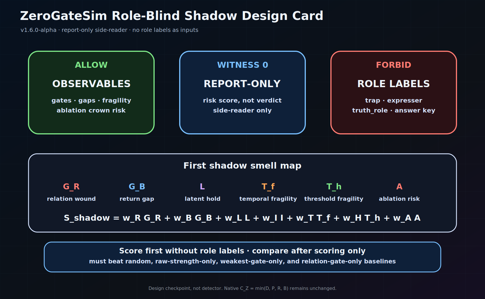
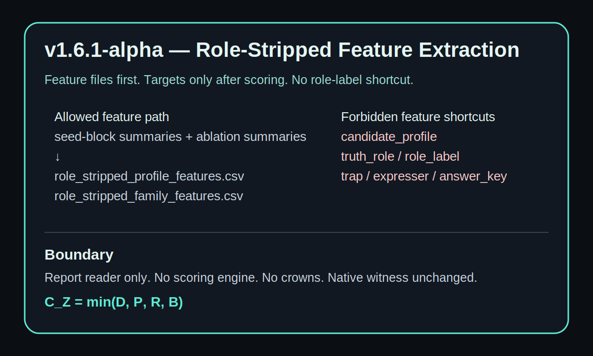
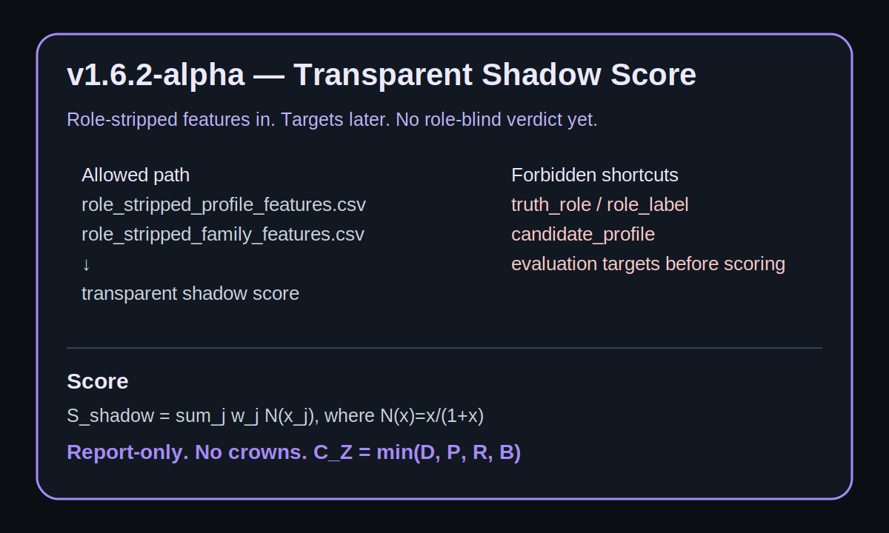
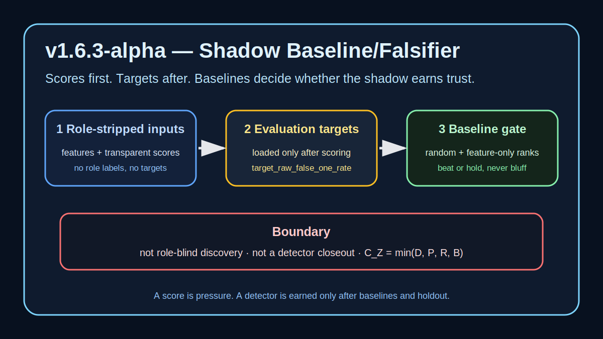

# ZeroGateSim

**Current public line:** `v1.6.12-alpha` — observable shadow feature implementation  
**Status:** speculative research software / controlled synthetic-field experiment line  
**Working identity:** zero-gate dimensional emergence simulator  
**Core question:** can a final trinary witness distinguish earned-one from raw expression pressure, latent overcrown, relation/return debt, and false-one pressure under controlled synthetic-field adversarial weather?

## What ZeroGateSim is

ZeroGateSim is a small research software project for testing a speculative theory of dimensional emergence. The historical first-research-alpha proof record remains a generated toy-field proof-of-concept; the v1.5 line uses controlled synthetic-field language for explicit, seeded, adversarial, bounded experiments; the v1.6 line begins role-blind shadow design without claiming role-blind discovery.

It does **not** prove cosmology, physical dimensions, or that reality itself is trinary.

It tests a narrower software-theory claim in the active v1.5/v1.6 line:

> Inside controlled synthetic fields, final earned-one witness can separate earned expression from raw expression pressure, latent overcrown, relation/return debt, and false-one pressure under four-gate adversarial pressure.

## Core theory

The central hypothesis is:

> Dimensionality emerges when candidate freedoms pass through the zero-gate cycle of distinction, polarity, relation, and return under trinary temporal ordering.

The four gates are:

- **Distinction** — something becomes separable from background.
- **Polarity** — distinction gains meaningful positive and negative expression around zero.
- **Relation** — polarity becomes bound into stable relation rather than split or drift.
- **Return** — expressed structure folds back toward zero while preserving coherence.

Return is not decorative. Distinction separates. Polarity tensions. Relation binds. When binding becomes coherent, expansion curves back as return.

The zero-gate coherence of candidate `i` at time `t` is:

```math
C_Z^i(t)=\min(g_D^i(t),g_P^i(t),g_R^i(t),g_B^i(t))
```

The minimum matters. A candidate does not pass because one gate is beautiful. The weakest gate decides the coherence pressure.

Raw local expression is not final +1. Final +1 belongs only to **earned-one**.

Core sentence:

> A real one is not the first thing after zero. A real one is what zero can return as without lying.


## Why this exists

The usual ladder of dimensional explanation often begins with:

> point, line, plane, cube, then time.

That ladder may work as a classroom drawing. It does not work as a genesis model. It describes completed structures, not how structure becomes expressible.

ZeroGateSim tests a different spine:

> Time is not merely the fourth room in the house of space. Time is the generative ordering condition through which dimensions become expressed.

In this frame:

- a point is the zero-zone of dimensional potential;
- a line is polarity around zero;
- a plane is relation between polarities;
- volume is closed relational freedom;
- a dimension is stabilized freedom that has passed through zero without losing coherence.

The simulator exists because a theory does not earn trust by sounding beautiful. It earns its first bones by meeting pressure.

## First visual spine

These first three maps are the fastest route into the project. They show mechanism, witness, and test pressure before the README descends into machinery.

### Zero-gate cycle


Native coherence is weakest-gate coherence:

```math
C_Z^i(t)=\min(D_i(t),P_i(t),R_i(t),B_i(t))
```

Raw expression is pressure, not final truth:

```math
\chi^i_{raw}(t)=H(\sigma_i(t)-\epsilon)H(C_Z^i(t)-\theta_Z)
```

### Trinary witness stack


Final earned-one is raw expression after return-depth, lineage, independence, and role-aware witness in the current harness:

```math
\chi^i_{earned}(t)=\chi^i_{raw}(t)H(k_i(t)-K^*)W^i_{lineage}(t)W^i_{independence}(t)W^i_{role}
```

The output grammar is trinary:

```text
+1 earned-one
 0 witness / hold / quarantine / not-yet
-1 resist / reject / false-one demotion
```

### Proof harness map


Weather is trinary, not decimal decoration:

```text
triad27 = 3^3 local expression weather
deep81  = 3^4 perturbation / late-shock bridge
wide243 = 3^5 temporal-depth / time-axis stress
```

Historical first-alpha used three dedicated adversarial corpora with return measured as native `B`. The current four-gate evidence route includes distinction, polarity, relation, and return as dedicated native run families before shadow claims are trusted.

## Native math witness

The v1.2 line asks whether the repository obeys its own native math before comparing itself with external formal logics.

Native anchors:

```math
E_0 = (Z_0, \tau)
```

```math
T_3[X](\tau) = (X(\tau+h)-X(\tau), I_h[X](\tau), X(\tau)-X(\tau-h))
```

```math
L_i = (-e_i, 0, +e_i)
```

```math
\Gamma_i(t)=D_i(t)P_i(t)R_i(t)
```

```math
C_Z^i(t)=\min(D_i(t),P_i(t),R_i(t),B_i(t))
```

```math
\chi^i_{raw}(t)=H(\sigma_i(t)-\epsilon)H(C_Z^i(t)-\theta_Z)
```

```math
\chi^i_{earned}(t)=\chi^i_{raw}(t)H(k_i(t)-K^*)W^i_{lineage}(t)W^i_{independence}(t)W^i_{role}
```

## Active route

The current route is:

```text
native geometry -> native math -> code fidelity -> invariant tests -> known logic mirrors -> stronger experiments -> shadow route audit -> feature implementation
```

Do not skip the order. ZeroGateSim is not helped by wearing a borrowed lab coat.

Read first:

- [`docs/math_witness_map.md`](docs/math_witness_map.md)
- [`docs/simulation_win_conditions.md`](docs/simulation_win_conditions.md)
- [`docs/controlled_synthetic_field_language.md`](docs/controlled_synthetic_field_language.md)
  - controlled synthetic-field language boundary for v1.5+ evidence wording.
- [`docs/shadow_route_audit_and_feature_design.md`](docs/shadow_route_audit_and_feature_design.md)
- [`docs/shadow_feature_implementation.md`](docs/shadow_feature_implementation.md)
- [`docs/shadow_discrimination_repair.md`](docs/shadow_discrimination_repair.md)
- [`docs/shadow_lane_discrimination.md`](docs/shadow_lane_discrimination.md)
- [`docs/runs_cleanup_policy.md`](docs/runs_cleanup_policy.md)
- [`docs/shadow_triad27_hardened_evidence.md`](docs/shadow_triad27_hardened_evidence.md)
- [`docs/shadow_weather_hardening.md`](docs/shadow_weather_hardening.md)
- [`docs/four_gate_reconciliation.md`](docs/four_gate_reconciliation.md)
- [`docs/claim_boundary.md`](docs/claim_boundary.md)

## Current evidence state

### First-research-alpha result

ZeroGateSim passed an original proof harness and a fresh-seed reproduction inside generated toy fields.

Combined record:

- `1458` scenario cells;
- `13122` seeded simulation runs;
- `22131` final earned-one events;
- `2388` raw false-one pressures detected and demoted;
- `0` final false-one crowns.

The machine did not prove the universe.

It did something narrower and real:

> it met false one, named it, and refused the crown.

### Fresh controlled deep81 / wide243 evidence

`v1.5.5-alpha` records the fresh controlled `deep81` and `wide243` four-gate evidence runs as README-visible cards and report files:

| profile | role in ladder | runs | earned-one events | raw false-one pressure | latent overcrown pressure | final false-one crowns |
|---|---|---:|---:|---:|---:|---:|
| `deep81` | perturbation / late-shock bridge | `2,916` | `5,155` | `402` | `639` | `0` |
| `wide243` | temporal-depth / time-axis stress | `8,748` | `16,217` | `1,242` | `2,043` | `0` |

Both runs passed with pressure visible, false-one pressure demoted, latent pressure held, and no final false-one crowns. These are controlled synthetic-field evidence witnesses, not physics proof.

### Shadow lane current result

The v1.6 shadow line is stricter than the native role-aware witness. It asks whether false-one-like pressure can be ranked from role-stripped observable behavior without role labels.

`v1.6.8-alpha` made triad27 harder by generating cell-level evidence. The result showed the frozen transparent shadow score could see pressure density, but it did not yet earn relation/return/demotion-specific discrimination beyond dumb baselines. `v1.6.9-alpha` added residual discrimination diagnostics. `v1.6.10-alpha` split the shadow lane into fixed candidate lane scores and added a local `runs/` inventory scaffold. `v1.6.11-alpha` repaired roadmap truth and defined the feature-design route. `v1.6.12-alpha` implements observable, role-stripped engineered feature columns and feature-aware candidate score columns. The next evidence gate is a hardened triad27 rerun; deep81 / wide243 remain blocked until triad27 specificity is earned.

Read the current shadow repair notes:

- [`docs/shadow_route_audit_and_feature_design.md`](docs/shadow_route_audit_and_feature_design.md)
- [`docs/shadow_feature_implementation.md`](docs/shadow_feature_implementation.md)
- [`docs/shadow_discrimination_repair.md`](docs/shadow_discrimination_repair.md)
- [`docs/shadow_lane_discrimination.md`](docs/shadow_lane_discrimination.md)
- [`docs/runs_cleanup_policy.md`](docs/runs_cleanup_policy.md)

## Evidence visuals

### First-research-alpha proof card


### Fresh controlled deep81 evidence card


### Fresh controlled wide243 evidence card


### Role-blind shadow design card



### Role-stripped feature extraction card



### Transparent shadow score card



### Shadow baseline/falsifier card



Visual guide:

- [`docs/visual_guide.md`](docs/visual_guide.md)
- [`docs/share_ready_reader_path.md`](docs/share_ready_reader_path.md)

## Known-logic comparison boundary

Known logic work has begun with fuzzy / many-valued, Belnap evidence-state, and paraconsistent conflict-locality mirrors. This is a projection mirror, not an identity claim.

The v1.3.0 fuzzy mirror compares native weakest-gate coherence against product, average, and Lukasiewicz-style continuous conjunctions. The v1.3.1 Belnap mirror projects final-output evidence into true-only, false-only, both, and neither states. The v1.3.2 paraconsistent mirror checks whether conflict pressure stays local instead of becoming arbitrary final +1. The v1.3.3 three-valued mirror compresses final output into true / unknown / false and reports what native zero information is lost. The v1.3.4 closeout summarizes all four mirrors and their loss reports. All are mirrors, not identity claims.

Allowed:

> Project ZeroGateSim states into fuzzy, Belnap, paraconsistent, Kleene, or Lukasiewicz mirrors to see what is preserved, collapsed, or distorted.

Forbidden:

> ZeroGateSim is identical to any of those logics.

The active mirror order is fuzzy / many-valued scoring first, Belnap evidence states second, then paraconsistent conflict locality, then Kleene / Lukasiewicz compression and loss reporting.


### Paraconsistent conflict-locality mirror outputs

Matrix runs now also write:

```text
matrix_paraconsistent_mirror_summary.csv
matrix_paraconsistent_mirror_read.md
```

The paraconsistent mirror asks one narrow question: when positive-looking pressure and contrary witness coexist, does the conflict remain local instead of exploding into final +1? It is not Priest logic and not a native gate. It is a conflict-locality witness.


### Belnap mirror outputs

Matrix runs now also write:

```text
matrix_belnap_mirror_summary.csv
matrix_belnap_mirror_read.md
```

The Belnap mirror projects final-output evidence into `T` true-only, `F` false-only, `B` both/conflict-pressure, and `N` neither. It does not replace the native earned-one witness. A `B` state is pressure under conflict, not permission to crown.

### Assistant test handoff

`v1.3.1-alpha` adds a small continuation tool:

```powershell
$env:PYTHONPATH = (Join-Path (Get-Location) "src")
& $P -m zerogate_sim.test_handoff --version v1.3.2-alpha --status passed --note "full test suite passed" --out runs\assistant_test_handoff_v1_3_2_alpha
```

It writes an uploadable `assistant_test_handoff.zip` so future continuation can see local gate results without guessing from scattered terminal fragments.


### Fuzzy mirror outputs

Matrix runs write:

```text
matrix_fuzzy_mirror_trace.csv
matrix_fuzzy_mirror_candidate_summary.csv
matrix_fuzzy_mirror_read.md
```

These compare `C_Z = min(D, P, R, B)` against fuzzy-style product, average, and Lukasiewicz conjunction mirrors. A fuzzy score is pressure, not final earned-one.

### Known-logic closeout outputs

Matrix runs now also write:

```text
matrix_known_logic_closeout_summary.csv
matrix_known_logic_closeout_read.md
```

These files close the first mirror line by saying what each mirror preserves, exposes, and destroys.


### Cross-logic comparison report

`v1.4.0-alpha` adds a report layer for completed matrix runs:

```powershell
$env:PYTHONPATH = (Join-Path (Get-Location) "src")
& $P -m zerogate_sim.cross_logic_report --matrix-dir runs\matrix_a --matrix-dir runs\matrix_b --out runs\cross_logic_comparison
```

It writes:

```text
cross_logic_comparison_summary.csv
cross_logic_comparison_matrix_summary.csv
cross_logic_comparison_mirror_summary.csv
cross_logic_comparison_read.md
cross_logic_report_bundle.zip
```

The report aggregates mirror pressure. It does not crown any external logic as authority.


### Cross-logic comparison presets

`v1.4.1-alpha` adds a preset writer for stronger comparison runs:

```powershell
$env:PYTHONPATH = (Join-Path (Get-Location) "src")
& $P -m zerogate_sim.comparison_preset --preset adversary_triad27 --out runs\comparison_preset_plan_v1_4_1
```

The preset writes a readable plan, manifest, and `run_preset.ps1`. It does not execute the runs automatically and is not evidence by itself.

### Seed-block four-gate report

`v1.5.0-alpha` adds a report reader for completed four-gate adversary matrix runs:

```powershell
$env:PYTHONPATH = (Join-Path (Get-Location) "src")
& $P -m zerogate_sim.seed_block_report --preset-dir runs\cross_logic_presets\adversary_triad27 --out runs\seed_block_four_gate_report
```

It writes `seed_block_four_gate_summary.csv`, `seed_block_four_gate_mirror_summary.csv`, `seed_block_four_gate_read.md`, and `seed_block_report_bundle.zip`. The report reads evidence; it does not run a new proof harness or claim physics.

### Threshold sensitivity report

`v1.5.1-alpha` adds a threshold sensitivity reader for completed seed-block reports:

```powershell
$env:PYTHONPATH = (Join-Path (Get-Location) "src")
& $P -m zerogate_sim.threshold_sensitivity --variant gate_050=runs\seed_block_gate_050 --variant gate_055=runs\seed_block_gate_055 --out runs\threshold_sensitivity_report
```

It writes `threshold_sensitivity_summary.csv`, `threshold_sensitivity_gate_summary.csv`, `threshold_sensitivity_mirror_summary.csv`, `threshold_sensitivity_read.md`, and `threshold_sensitivity_bundle.zip`. The report reads completed evidence; it does not change the native gate law or claim physics.


### Witness ablation report

`v1.5.2-alpha` adds a post-hoc witness ablation reader for completed four-gate matrix outputs:

```powershell
$env:PYTHONPATH = (Join-Path (Get-Location) "src")
& $P -m zerogate_sim.witness_ablation_report --preset-dir runs\cross_logic_presets\adversary_triad27 --out runs\witness_ablation_report
```

It writes `witness_ablation_summary.csv`, `witness_ablation_gate_summary.csv`, `witness_ablation_read.md`, and `witness_ablation_bundle.zip`. The report does not mutate the native gate law. It asks what would be promoted or hidden if final witness accounting layers were disabled.

### Wide243 historical evidence intake

`v1.5.4-alpha` records the uploaded original and fresh-seed `wide243` proof archives as historical evidence intake:

```text
13,122 seeded runs
22,131 final earned-one events
2,388 raw false-one pressures detected and demoted
2,442 latent overcrown pressures held in zero
0 final false-one crowns
```

The report keeps the first-research-alpha archives in the generated toy-field proof-floor lane while explaining how `wide243 = 3^5` adds temporal-depth / time-axis pressure. It also gives the order for fresh controlled `deep81` and `wide243` four-gate reruns.

Read it here: [`docs/reports/wide243_historical_evidence_intake.md`](docs/reports/wide243_historical_evidence_intake.md).

### Fresh controlled deep81 / wide243 evidence

`v1.5.5-alpha` records the fresh controlled `deep81` and `wide243` four-gate evidence runs as README-visible cards and report files:

| profile | role in ladder | runs | earned-one events | raw false-one pressure | latent overcrown pressure | final false-one crowns |
|---|---|---:|---:|---:|---:|---:|
| `deep81` | perturbation / late-shock bridge | `2,916` | `5,155` | `402` | `639` | `0` |
| `wide243` | temporal-depth / time-axis stress | `8,748` | `16,217` | `1,242` | `2,043` | `0` |

Both runs passed with pressure visible, false-one pressure demoted, latent pressure held, and no final false-one crowns.

Derived report metrics were added for paper and visual work:

```math
\rho_F = \frac{F_{raw}}{N_{runs}},\quad
\rho_L = \frac{L_{held}}{N_{runs}},\quad
K_R = \frac{F_{relation}}{\sum_g F_g},\quad
A_F = \max(F^{ablation}_{final}) - F^{control}_{final}
```

For `wide243`, temporal-stretch severity is read as:

```math
S_{\tau} = B_{\tau+} - B_{\tau-}
```

These are **derived evidence witnesses**, not new native gates. The native math witness remains `C_Z = min(D, P, R, B)` and final earned-one still requires the existing final witness stack.

Reports:

- [`docs/reports/fresh_controlled_deep81_four_gate_evidence_report.md`](docs/reports/fresh_controlled_deep81_four_gate_evidence_report.md)
- [`docs/reports/fresh_controlled_wide243_four_gate_evidence_report.md`](docs/reports/fresh_controlled_wide243_four_gate_evidence_report.md)
- [`docs/role_blind_shadow_design.md`](docs/role_blind_shadow_design.md)
- [`docs/role_blind_shadow_schema.json`](docs/role_blind_shadow_schema.json)
- [`docs/role_stripped_feature_extraction.md`](docs/role_stripped_feature_extraction.md)
- [`docs/transparent_shadow_score.md`](docs/transparent_shadow_score.md)
- [`docs/shadow_baseline_falsifier.md`](docs/shadow_baseline_falsifier.md)
- [`docs/four_gate_reconciliation.md`](docs/four_gate_reconciliation.md)
- [`docs/shadow_triad27_preflight.md`](docs/shadow_triad27_preflight.md)
- [`docs/shadow_holdout_evaluation.md`](docs/shadow_holdout_evaluation.md)
- [`docs/reports/fresh_controlled_81_243_visual_source.csv`](docs/reports/fresh_controlled_81_243_visual_source.csv)

### Role-blind shadow design

`v1.6.0-alpha` starts the role-blind shadow line as design only. The shadow is a report-side reader that may inspect observable pressure behavior but must not inspect designed truth-role labels.

Allowed shadow inputs include gate vectors, weakest-gate pressure, return gap, relation wound, zero-depth instability, threshold fragility, temporal fragility, and ablation crown risk.

Forbidden shadow inputs include designed `trap`, `expresser`, `latent/probe`, `truth_role`, `role_label`, and `candidate_profile` fields.

The first shadow score is designed as a transparent risk witness, not a verdict:

```math
S_{shadow}=w_R G_R+w_B G_B+w_L L+w_I I+w_T T_f+w_H H_f+w_A A
```

The native witness still decides final earned-one:

```math
C_Z = min(D, P, R, B)
```

Role-blind shadow does not replace `W_role`, crown candidates, demote candidates, or claim discovery. It only asks whether a candidate behaves like false-one pressure from observable behavior alone.

Read the design:

- [`docs/role_blind_shadow_design.md`](docs/role_blind_shadow_design.md)
- [`docs/role_blind_shadow_schema.json`](docs/role_blind_shadow_schema.json)

### Role-stripped feature extraction

`v1.6.1-alpha` adds the first report reader for the shadow line:

```powershell
$env:PYTHONPATH = (Join-Path (Get-Location) "src")
& $P -m zerogate_sim.role_stripped_feature_report `
  --seed-summary deep81=runs\controlled_deep81_four_gate_v1_5_4\reports\seed_block_four_gate_report\seed_block_four_gate_summary.csv `
  --ablation-summary deep81=runs\controlled_deep81_four_gate_v1_5_4\reports\witness_ablation_report\witness_ablation_summary.csv `
  --seed-summary wide243=runs\controlled_wide243_four_gate_v1_5_4\reports\seed_block_four_gate_report\seed_block_four_gate_summary.csv `
  --ablation-summary wide243=runs\controlled_wide243_four_gate_v1_5_4\reports\witness_ablation_report\witness_ablation_summary.csv `
  --out runs\role_stripped_feature_report_v1_6_1
```

It writes role-stripped feature files and a separate evaluation-target file. Future shadow scoring must load the feature files first and compare against targets only after scoring.

Read the extraction boundary:

- [`docs/role_stripped_feature_extraction.md`](docs/role_stripped_feature_extraction.md)

### Transparent shadow score prototype

`v1.6.2-alpha` adds the first transparent report-side shadow score:

```powershell
$env:PYTHONPATH = (Join-Path (Get-Location) "src")
& $P -m zerogate_sim.shadow_score_report `
  --profile-features runs\role_stripped_feature_report_v1_6_1\role_stripped_profile_features.csv `
  --family-features runs\role_stripped_feature_report_v1_6_1\role_stripped_family_features.csv `
  --out runs\shadow_score_report_v1_6_2
```

It reads role-stripped feature files only. It does not read evaluation targets, role labels, or candidate profiles. The output is a transparent score report, not a verdict.

Read the score boundary:

- [`docs/transparent_shadow_score.md`](docs/transparent_shadow_score.md)

### Shadow baseline/falsifier report

`v1.6.3-alpha` adds the first baseline/falsifier comparison for the shadow line:

```powershell
$env:PYTHONPATH = (Join-Path (Get-Location) "src")
& $P -m zerogate_sim.shadow_baseline_falsifier_report `
  --profile-features runs\role_stripped_feature_report_v1_6_1\role_stripped_profile_features.csv `
  --family-features runs\role_stripped_feature_report_v1_6_1\role_stripped_family_features.csv `
  --profile-scores runs\shadow_score_report_v1_6_2\shadow_score_profile_scores.csv `
  --family-scores runs\shadow_score_report_v1_6_2\shadow_score_family_scores.csv `
  --evaluation-targets runs\role_stripped_feature_report_v1_6_1\role_stripped_evaluation_targets.csv `
  --out runs\shadow_baseline_falsifier_report_v1_6_3
```

It compares scores to targets only after the role-stripped scoring pass. It writes ranking metrics against available baselines and records exact-baseline schema gaps instead of inventing missing evidence. The result is still not role-blind discovery.

Read the falsifier boundary:

- [`docs/shadow_baseline_falsifier.md`](docs/shadow_baseline_falsifier.md)
- [`docs/four_gate_reconciliation.md`](docs/four_gate_reconciliation.md)

### Shadow triad27 preflight

`v1.6.7-alpha` adds the harder cross-rung weather hardening judge. Run this before treating any larger weather as stronger evidence:

```powershell
$env:PYTHONPATH = (Join-Path (Get-Location) "src")

& $P -m zerogate_sim.shadow_weather_hardening_report `
  --source triad27=runs\shadow_triad27_actual_v1_6_6 `
  --required-rung triad27 `
  --out runs\shadow_weather_hardening_v1_6_7_triad27
```

This report writes:

```text
weather_hardening_baseline_comparison.csv
weather_hardening_target_diagnostics.csv
weather_hardening_native_gate_metrics.csv
weather_hardening_decision.json
weather_hardening_audit.json
weather_hardening_read.md
weather_hardening_bundle.zip
```

It is still not role-blind discovery. It is the harder judge.

`v1.6.6-alpha` adds the first trinary-weather shadow preflight:

```powershell
$env:PYTHONPATH = (Join-Path (Get-Location) "src")
& $P -m zerogate_sim.shadow_triad27_preflight_report `
  --profile-features runs\role_stripped_feature_report_v1_6_6_triad27\role_stripped_profile_features.csv `
  --family-features runs\role_stripped_feature_report_v1_6_6_triad27\role_stripped_family_features.csv `
  --profile-scores runs\shadow_score_report_v1_6_6_triad27\shadow_score_profile_scores.csv `
  --family-scores runs\shadow_score_report_v1_6_6_triad27\shadow_score_family_scores.csv `
  --evaluation-targets runs\role_stripped_feature_report_v1_6_6_triad27\role_stripped_evaluation_targets.csv `
  --required-source triad27 `
  --out runs\shadow_triad27_preflight_v1_6_6
```

It checks the `triad27 = 3^3` local expression weather rung before deeper `deep81` / `wide243` evidence. It is still not role-blind discovery.

Read the triad27 boundary:

- [`docs/shadow_triad27_preflight.md`](docs/shadow_triad27_preflight.md)

### Shadow holdout evaluation

`v1.6.5-alpha` adds the held-out role-stripped evaluation tool. After `v1.6.6-alpha`, this deeper report should be used after triad27 preflight:

```powershell
$env:PYTHONPATH = (Join-Path (Get-Location) "src")
& $P -m zerogate_sim.shadow_holdout_evaluation_report `
  --profile-features runs\role_stripped_feature_report_v1_6_5_holdout\role_stripped_profile_features.csv `
  --family-features runs\role_stripped_feature_report_v1_6_5_holdout\role_stripped_family_features.csv `
  --profile-scores runs\shadow_score_report_v1_6_5_holdout\shadow_score_profile_scores.csv `
  --family-scores runs\shadow_score_report_v1_6_5_holdout\shadow_score_family_scores.csv `
  --evaluation-targets runs\role_stripped_feature_report_v1_6_5_holdout\role_stripped_evaluation_targets.csv `
  --required-source deep81 `
  --required-source wide243 `
  --out runs\shadow_holdout_evaluation_v1_6_5
```

It evaluates scores only after they have already been written, requires visible `deep81` / `wide243` holdout sources, and reports whether the shadow survives available baselines. It is still not role-blind discovery.

Read the holdout boundary:

- [`docs/shadow_holdout_evaluation.md`](docs/shadow_holdout_evaluation.md)

## Shadow discrimination repair

`v1.6.9-alpha` adds a residual discrimination report for the shadow line:

```powershell
$env:PYTHONPATH = (Join-Path (Get-Location) "src")

& $P -m zerogate_sim.shadow_discrimination_report `
  --hardening-comparison runs\shadow_triad27_harder_v1_6_8\triad27_hardened_evidence\weather_hardening `
  --out runs\shadow_discrimination_v1_6_9_triad27
```

It asks whether the frozen shadow score sees anything after the best available baseline already explains the easy target pressure. It does not retune the score and is not role-blind discovery.

The first proof record used three adversarial dependency corpora:

- **Distinction adversary:** visibility and contrast pretending to be reality.
- **Polarity adversary:** pulse and zero-crossing pretending to be return.
- **Relation adversary:** borrowed coherence pretending to be earned one.

That historical proof record remains a controlled proof-of-concept. The current v1.4 comparison preset layer is stricter: four-gate adversary presets must cover distinction, polarity, relation, and observed return as dedicated run families.

Run shape for the v1 proof record:

- `3` adversarial corpora;
- `243` weather cells per corpus;
- `9` seeds per proof record;
- `729` scenario cells per proof record;
- `6561` seeded runs per proof record;
- original seeds `0-8` and reproduction seeds `9-17`.

Read the proof card:

- [`docs/proof_records/first_research_alpha/proof_card.md`](docs/proof_records/first_research_alpha/proof_card.md)

## Quickstart

Install/update locally:

```powershell
Set-Location C:\dev\zerogate_sim
$P = ".\.venv\Scripts\python.exe"
& $P -m pip install -e ".[dev]"
& $P -m pytest
```

Run a small demo first:

```powershell
& $P -m zerogate_sim.demo --seed 42 --out runs\demo_seed_42
```

Run the native math invariant tests:

```powershell
& $P -m pytest tests\test_native_math_invariants.py -q
```

Run the original proof harness:

```powershell
& $P -m zerogate_sim.proof --profile wide243 --start-seed 0 --count 9 --out runs\proof_wide243_0_8_v033
& $P -m zerogate_sim.proof_record --proof-dir runs\proof_wide243_0_8_v033
```

Run the fresh-seed reproduction:

```powershell
& $P -m zerogate_sim.proof --profile wide243 --start-seed 9 --count 9 --out runs\proof_wide243_9_17_repro
& $P -m zerogate_sim.proof_record --proof-dir runs\proof_wide243_9_17_repro
```

Freeze the combined record:

```powershell
& $P -m zerogate_sim.release_record --proof-dir runs\proof_wide243_0_8_v033 --proof-dir runs\proof_wide243_9_17_repro --out runs\first_research_alpha_v1_0_alpha
```

More detailed quickstart:

- [`docs/quickstart.md`](docs/quickstart.md)

## Claim boundary

Supported claim:

> ZeroGateSim's final trinary witness separated earned-one from raw expression, latent overcrown, and false-one pressure across original and fresh-seed trinary adversarial proof records inside generated toy fields.

Unsupported claims:

- this proves physical dimensions;
- this proves cosmology;
- this proves that reality itself is trinary;
- this replaces physics or mathematics;
- this already validates the model against external many-valued logics;
- this already solves role-blind false-one detection.

Read the full boundary:

- [`docs/claim_boundary.md`](docs/claim_boundary.md)

## Paper lineage

Do not overwrite the original theory draft.

The repo preserves two lanes:

- [`docs/papers/history/`](docs/papers/history/) — original pre-simulation manuscript, preserved as historical trace.
- [`docs/papers/zenodo_ready/`](docs/papers/zenodo_ready/) — later simulation-supported manuscript scaffold.

This keeps the lineage honest:

> original seeing → executable simulation → proof-of-concept record → simulation-supported paper → native math witness lock → known-logic mirrors → controlled synthetic-field experiments.

## For reviewers and interested readers

Recommended route:

1. README top card.
2. Claim boundary.
3. Math witness map.
4. Visual route.
5. Proof card.
6. Quickstart or code.
7. Historical manuscript only after the current proof boundary is understood.

Reviewer guide:

- [`docs/for_reviewers.md`](docs/for_reviewers.md)

## Boundary and release references

Long release and process lists live in dedicated files so the README begins with the project rather than bookkeeping:

- [`docs/runtime_ci_support.md`](docs/runtime_ci_support.md) — Python/runtime and CI support boundary.
- [`docs/test_truth_and_handoff_boundary.md`](docs/test_truth_and_handoff_boundary.md) — strict assistant handoff, `runs/` evidence, and test-truth rules.
- [`docs/version_truth.md`](docs/version_truth.md) — release spine and recent checkpoints.
- [`docs/release_notes/`](docs/release_notes/) — detailed release notes.

## License and citation

The source repository uses the MIT License.

Citation metadata is stored in [`CITATION.cff`](CITATION.cff). The DOI field is intentionally absent until a Zenodo record exists.

Future manuscript and evidence records may use separate explicit licenses.
