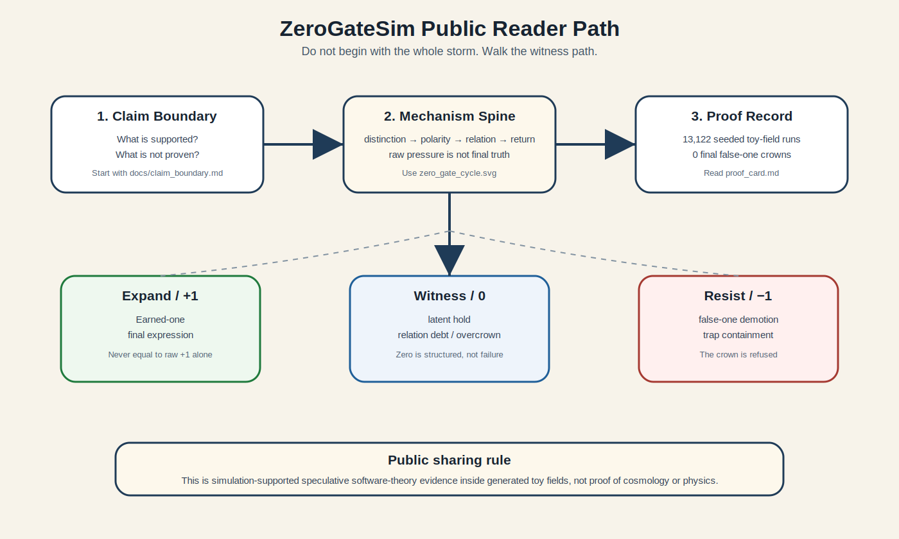

# Share-Ready Reader Path

This page is the public front-room route for ZeroGateSim.

The goal is not to make a reader swallow the whole storm. The goal is to let them walk the witness path in the right order.

## Expand

Start with the supported claim:

ZeroGateSim's final trinary witness separated earned-one from raw expression, latent overcrown, and false-one pressure across original and fresh-seed trinary adversarial proof records.

The core proof-card numbers are:

- 13,122 seeded toy-field runs;
- 22,131 final earned-one events;
- 2,388 raw false-one pressures detected and demoted;
- 0 final false-one crowns.

## Witness

The reader should then see why raw expression is not the final crown.

Read in this order:

1. `docs/claim_boundary.md`
2. `docs/visual_guide.md`
3. `docs/proof_records/first_research_alpha/proof_card.md`
4. `docs/for_reviewers.md`
5. `README.md`

This order protects the reader from mistaking a poetic theory for a tested physics claim.

## Resist

Do not begin with the original historical PDF as the public entry point.

The historical manuscript matters, but it predates the simulation repairs. It belongs in the lineage, not as the final current claim.

The public first impression should be:

> Small engine. Large weather. Clear witness.

## Operating sentence

A real one is not the first thing after zero. A real one is what zero can return as without lying.
