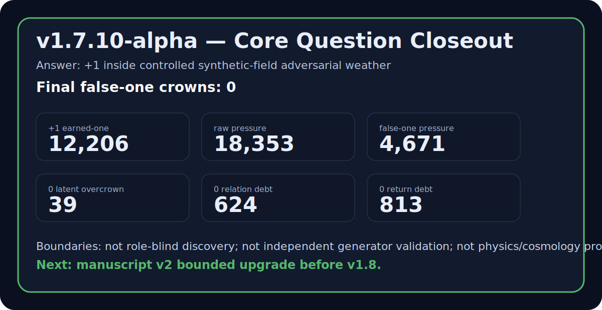

# v1.7 Core Question Closeout

> **Historical / superseded:** `v1.7.11-alpha` reopens this decision at `0 / HOLD`. The v1.7.10 output is reproducible history, but its zero-false-crown result is construction-bound and its pooled rung totals are nested arithmetic sums, not independent evidence. See [`v1_7_11_evidence_integrity_correction.md`](v1_7_11_evidence_integrity_correction.md).

**Version:** `v1.7.10-alpha`  
**Decision:** `+1 controlled_synthetic_field_answer_earned`  
**Native witness:** `C_Z = min(D, P, R, B)`

## Question

> Can a final trinary witness distinguish earned-one from raw expression pressure, latent overcrown, relation debt, return debt, and false-one pressure under controlled synthetic-field adversarial weather?

## Answer

> Historical v1.7.10 answer: Yes, inside controlled synthetic-field adversarial weather.

That answer was bounded even when issued. v1.7.11 now withdraws its current
authority and reopens the software-theory question at `0 / HOLD`.



## Evidence spine

```text
triad27 -> inspect -> deep81 -> inspect -> wide243 -> inspect -> anti-tautology audit -> repo cohesion -> reviewer package -> closeout
```

The latest three-rung snapshot remains:

```text
+1 earned-one total       = 12,206
raw expression pressure   = 18,353
0 latent overcrown        = 39
0 relation debt           = 624
0 return debt             = 813
-1 false-one pressure     = 4,671
final false-one crowns    = 0
lane pattern              = true across triad27 / deep81 / wide243
```

## Closeout sentence

ZeroGateSim `v1.7.10-alpha` recorded the v1.7 core question as `+1` inside controlled synthetic-field adversarial weather. This historical sentence is superseded by the v1.7.11 `0 / HOLD` correction.

## What remains forbidden

- role-blind discovery solved;
- independent generator validation;
- external empirical validation;
- physics, cosmology, observed-universe, quantum, wormhole, spacetime, or dimensional-origin proof;
- manuscript v2 already written;
- v1.8 beginning before manuscript v2 is drafted or deliberately frozen.

## Next

Historical next movement, superseded by v1.7.11: manuscript v2 upgrade before v1.8. Current movement: role-free witness repair; manuscript remains on HOLD.
