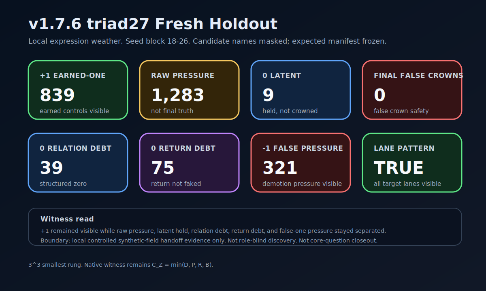
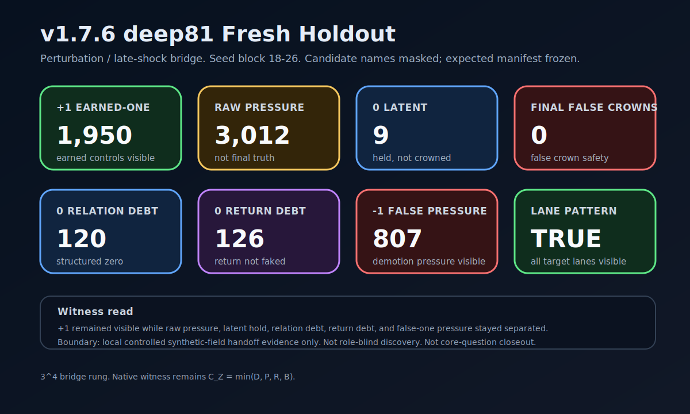
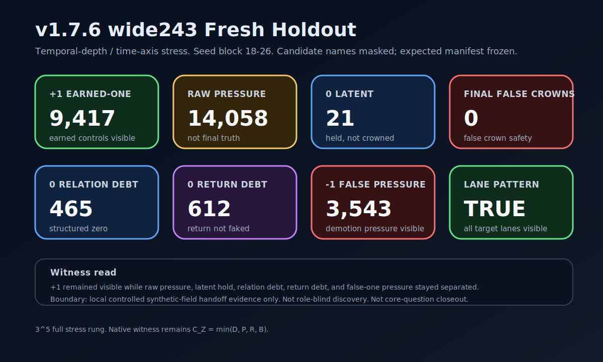
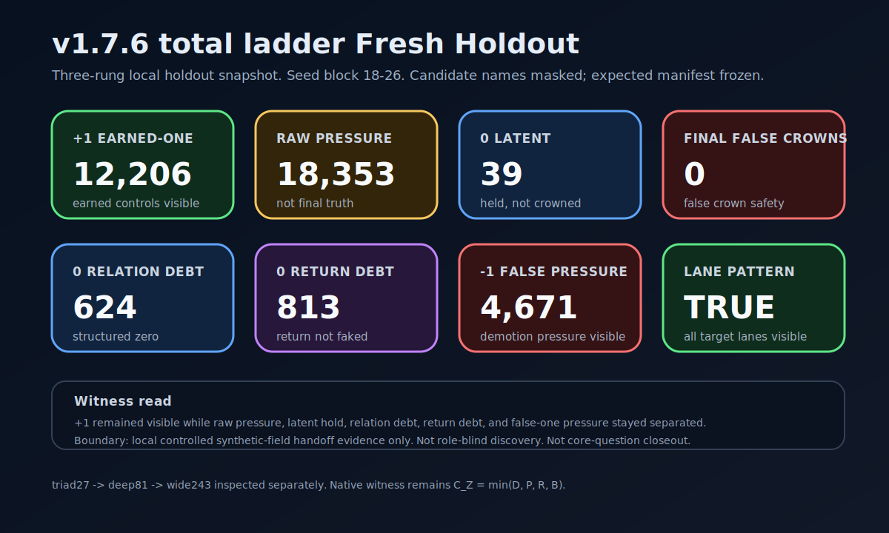

# v1.7 Latest Holdout Snapshot

**Status:** local assistant-handoff evidence snapshot from the `v1.7.6-alpha` fresh holdout ladder  
**Repo gates using it:** `v1.7.8-alpha` front-page cleanup / cohesion check; `v1.7.9-alpha` reviewer reproduction package path; `v1.7.10-alpha` bounded core-question closeout  
**Boundary:** controlled synthetic-field evidence only; not role-blind discovery, not independent-generator validation, not physics, not cosmology.

This page records the compact result from the three separate rung handoffs inspected after `v1.7.6-alpha`.

The run law remains:

```text
triad27 -> inspect -> deep81 -> inspect -> wide243 -> inspect -> reviewer package -> v1.7.10 bounded closeout
```

The combined snapshot must not replace the separate rung records. It is a front-page orientation layer.

## Visual rung cards

### triad27 — local expression weather



```text
+1 earned-one            839
raw expression pressure  1,283
0 latent overcrown       9
0 relation debt          39
0 return debt            75
-1 false-one pressure    321
final false-one crowns   0
lane pattern             true
```

### deep81 — perturbation / late-shock bridge



```text
+1 earned-one            1,950
raw expression pressure  3,012
0 latent overcrown       9
0 relation debt          120
0 return debt            126
-1 false-one pressure    807
final false-one crowns   0
lane pattern             true
```

### wide243 — temporal-depth / time-axis stress



```text
+1 earned-one            9,417
raw expression pressure  14,058
0 latent overcrown       21
0 relation debt          465
0 return debt            612
-1 false-one pressure    3,543
final false-one crowns   0
lane pattern             true
```

### combined witness read



```text
+1 earned-one total       = 12,206
raw expression pressure   = 18,353
0 latent overcrown        = 39
0 relation debt           = 624
0 return debt             = 813
-1 false-one pressure     = 4,671
final false-one crowns    = 0
lane pattern              = true across all three rungs
```

## Witness interpretation

The useful result is not just `final false-one crowns = 0`.

The useful result is the whole pattern:

```text
earned-one remains visible;
raw expression pressure rises under deeper weather;
latent overcrown remains held;
relation debt remains visible;
return debt remains visible;
false-one pressure rises under deeper weather;
final false-one crowns remain zero.
```

That pattern supported reviewer packaging after the anti-tautology / role-dependence audit and front-page cohesion check. In `v1.7.10-alpha`, it contributes to the bounded `+1` closeout of the controlled synthetic-field core question.

It still does not support role-blind discovery, independent generator validation, or physics/cosmology claims.

## Next required use

`v1.7.10-alpha` closes the bounded core question. The next movement is manuscript v2 as a bounded upgrade before v1.8.
